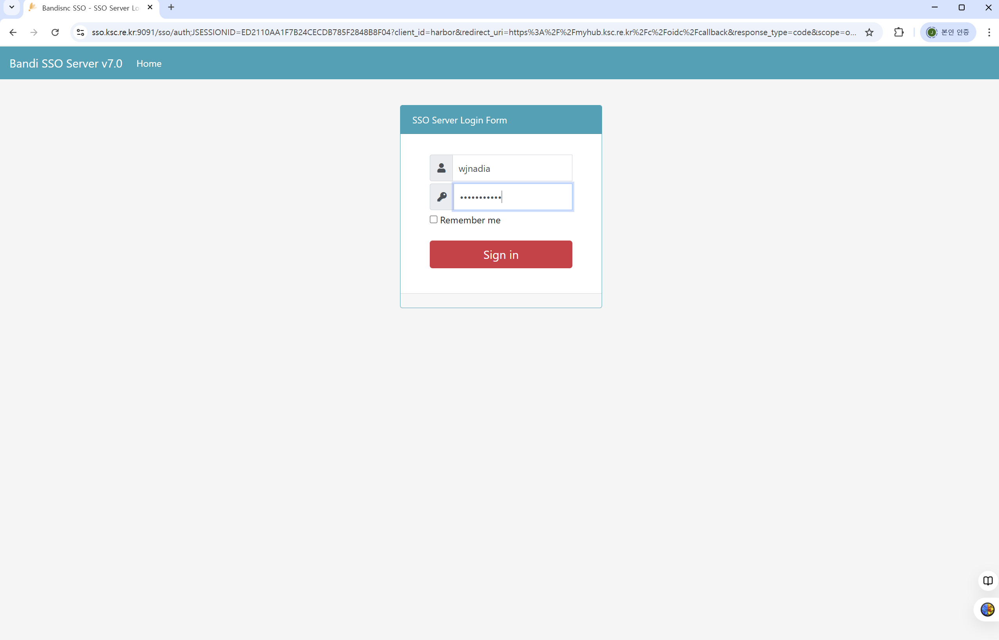

# 컨테이너 활용 가이드

뉴론 시스템은 HPC 응용 및 AI 학습/추론 등에서 복잡한 소프트웨어 의존성을 해결하고     다양한 시스템에서 일관된 작업 환경을  유지할 수 있도록 최적화된 컨테이너 활용 환경을   제공합니다.        &#x20;

사용자는 자신의 작업 단계(빌드, 실행)에 맞춰 적절한 도구를 선택하여 사용할 수 있습니다.


* **Podman** : 일반 사용자 권한 기반의 이미지 빌드 및 관리 도구입니다. Docker를 대체하여 이미지를 생성할 때 사용합니다.
* **Enroot** : NVIDIA에서 개발한 HPC 전용 런타임입니다. 컨테이너 이미지를 SquashFS(`.sqsh`)로 변환하여 Nvidia GPU에 최적화 되어 있으며, Pyxis 플러그인을 통해 Slurm 스케줄러와 유기적으로 연동됩니다.
* **Singularity** : HPC 환경의 표준 컨테이너 도구로, 높은 범용성과 기존 구축된 `.sif` 이미지와의 호환성을 제공합니다



### 1.  컨테이너 도구 선택 가이드

사용자의 목적 및 실행 노드 특성에 따라 최적의 도구를 선택할 수 있습니다.

<table data-header-hidden><thead><tr><th width="104.800048828125" align="center"></th><th align="center"></th><th align="center"></th><th align="center"></th></tr></thead><tbody><tr><td align="center"><strong>구분</strong></td><td align="center"><strong>Podman</strong><br><strong>(빌드/관리)</strong></td><td align="center"><strong>Enroot</strong><br><strong>(GPU 실행)</strong></td><td align="center"><strong>Singularity</strong><br><strong>(범용 실행)</strong></td></tr><tr><td align="center">주요 역할</td><td align="center"><p>이미지 생성 </p><p>및 커스터마이징</p></td><td align="center"><p>GPU 연산 가속 </p><p>(권장)</p></td><td align="center">시스템 간<br>호환성 유지</td></tr><tr><td align="center">저장 형식</td><td align="center"><p>OCI 레이어 </p><p>(디렉터리)</p></td><td align="center"><p><code>.sqsh</code> </p><p>(단일 압축 파일)</p></td><td align="center"><p><code>.sif</code> </p><p>(단일 이미지 파일)</p></td></tr><tr><td align="center">특징</td><td align="center">Docker 명령어 호환</td><td align="center">빠른 로딩, <br>Nvidia GPU 최적화</td><td align="center">기존 뉴론 컨테이너환경 유지</td></tr></tbody></table>


Singularity 에 대한 자세한 사용법은 [**Singularity 컨테이너**](https://docs-ksc.gitbook.io/neuron-user-guide/undefined-2/appendix-3-how-to-use-singularity-container) 를 참조하세요.



### 2. 이미지 빌드 및 관리 (Podman)

로그인 노드 또는 계산 노드에서 Podman을 사용하여 컨테이너 이미지를 준비합니다.

#### 가. Podman 사용 설정

Podman 사용 환경 설정을 위해서는 먼저 사용자 홈 디렉터리에 .usepodman 이라는 파일을 생성해야 합니다. 한 번만 생성하면 되고 로그아웃 후 다시 로그인 하면 바로 적용 됩니다.

```
$ cd ~                # 사용자홈 디렉터리(/home01/[ID])로 이동             
$ touch .usepodman    
$ ls -la .usepodman
-rw-r--r-- 1 test test 0  3월  3 11:19 .usepodman
$ exit                # 로그아웃 후 다시 로그인
```

#### 나. 외부 이미지 가져오기 (Pull)

NGC(NVIDIA GPU Cloud) 등에서 이미지를 가져옵니다.

<pre><code># NGC에서 PyTorch 24.12 버전 가져오기
$ podman pull nvcr.io/nvidia/pytorch:24.12-py3
$ podman images
REPOSITORY              TAG         IMAGE ID      CREATED      SIZE
<strong>nvcr.io/nvidia/pytorch  24.12-py3   dd94fce2f83a  7 weeks ago  20.6 GB
</strong></code></pre>

사용자 소스 코드나 특정 라이브러리를 포함한 커스텀 이미지를 생성합니다.

이미지 빌드 시간이 길고 부하가 많이 걸리는 경우, 스케줄러(SLURM)를 통해 인터랙티브 모드로 할당된  계산  노드에 접속하여 빌드하는 것을 권장합니다. &#x20;

<pre><code>## 스케줄러(SLURM)를 통해 인터랙티브 모드로 할당된 계산노드에 접속
$  srun --partition=cas_v100_4 --nodes=1 --ntasks-per-node=2 --cpus-per-task=10 --gres=gpu:2 --comment=pytorch --pty bash

# 현재 디렉터리(.)의 Dockerfile로 'my_pytorch:v1' 이미지 빌드
$ ls Dockerfile
Dockerfile
$ podman build -t my_pytorch:v1 . 
$ podman images
REPOSITORY              TAG         IMAGE ID      CREATED        SIZE
<strong>localhost/my_pytorch    v1          d9c8064f0996  6 seconds ago  20.6 GB
</strong>nvcr.io/nvidia/pytorch  24.12-py3   dd94fce2f83a  7 weeks ago    20.6 GB
</code></pre>


```
# 1. 베이스 이미지 지정 (NVIDIA GPU Cloud 제공 이미지)
FROM nvcr.io/nvidia/pytorch:24.12-py3

# 2. 메타데이터 설정
LABEL maintainer="user_id@ksc.re.kr"

# 3. 추가 시스템 패키지 설치 (필요시)
RUN apt-get update && apt-get install -y \
    wget \
    git \
    && rm -rf /var/lib/apt/lists/*

# 4. Python 라이브러리 추가 설치 (pip 활용)
RUN pip install --no-cache-dir \
    pandas \
    scikit-learn \
    matplotlib

# 5. 작업 디렉토리 설정
WORKDIR /workspace
```




**이미지 빌드 명령어**


```
$ podman build [옵션] -t [이미지명]:[태그] [Dockerfile경로]
-t, --tag: 이미지 이름과 버전(태그) 지정(예: my_env:v1.0)
-f, --file: 기본 파일명(Dockerfile)이 아닌 다른 이름의 파일을 사용할 때 지정
--no-cache: 캐시를 사용하지 않고 모든 단계를 새로 빌드(라이브러리 업데이트 시 유용)
-v, --volume: 빌드 과정 중 호스트 디렉토리를 마운트해야 할 때 사용

# 특정 파일을 지정하여 빌드
$ podman build -f Dockerfile.gpu -t my_pytorch:gpu_ver .
```



**이미지 관리 명령어 요약**


<table data-header-hidden><thead><tr><th width="111.66668701171875" align="center"></th><th width="235.60009765625"></th><th></th></tr></thead><tbody><tr><td align="center"><strong>기능</strong></td><td><strong>명령어</strong></td><td><strong>설명</strong></td></tr><tr><td align="center">목록 확인</td><td><sub>$ podman images</sub></td><td>로컬에 저장된 이미지 리스트 출력</td></tr><tr><td align="center">이미지 삭제</td><td><sub>$ podman rmi [이미지ID]</sub></td><td>불필요한 이미지 제거</td></tr><tr><td align="center">상세 정보</td><td><sub>$ podman inspect [이미지ID]</sub></td><td>이미지 레이어, 환경변수 등 상세 정보 확인</td></tr><tr><td align="center">태그 변경</td><td><sub>$ podman tag [기존이름] [새이름]</sub></td><td>이미지에 새로운 이름/태그 부여</td></tr></tbody></table>

### 3. 이미지 업로드

Podman으로 빌드한 이미지를 **외부 저장소인 Docker Hub** 또는 **KISTI 내부 저장소인 myhub**에 업로드하여 관리 및 공유 할 수 있습니다. 특히, 로그인  또는 계산 노드의 로컬 파일시스템에 저장된 이미지는 영구 보관되지  않기  때문에,  외부 또는 내부 저장소에 이미지를 업로드하는 것을 권장합니다.  &#x20;

#### 가. Docker Hub 또는 myhub 로그인

먼저 Podman을 통해 Docker Hub 또는 myhub 계정으로 인증합니다.

**1) Docker Hub**

```
$ podman login docker.io
# Username과 Password(또는 Access Token)를 입력합니다.
```

**2) myhub**


```
$ podman login myhub.ksc.re.kr
# Username(슈퍼컴퓨터 계정 ID)와 Password(CLI secert)을 입력합니다.
```



myhub 를 사용하기 위해서는 먼저  웹  브라우저에서 [**https://myhub.ksc.re.kr**](https://myhub.ksc.re.kr/)에 슈퍼컴퓨터 계정으로 로그인하여 **사용자 프로젝트**를 생성하고  CLI secret을  복사해 와야 합니다.&#x20;

<i class="fa-linktree">:linktree:</i> 자세한 사용 방법은 [**myhub 사용법**](appendix-12-how-to-use-containers.md#myhub)을 참조하시기 바랍니다.&#x20;



#### 나. 이미지 태그(Tag) 설정

업로드를 위해서는 이미지 이름을 **\[레지스트리주소]/\[Username 또는 프로젝트명]/\[이미지명]:\[버전태그]** 형식으로 지정해야 합니다.

**1) Docker Hub**

```
# 로컬 이미지(my_pytorch:v1)를 Docker Hub 형식으로 태그
$ podman tag localhost/my_pytorch:v1 docker.io/[Username]/my_pytorch:v1
```

**2) myhub**

```
# 로컬 이미지(my_pytorch:v1)를 myhub 형식으로 태그
$ podman tag localhost/my_pytorch:v1 myhub.ksc.re.kr/[프로젝트명]/my_pytorch:v1
```


#### 다. 이미지 업로드(Push)

태그가 완료된 이미지를 Docker Hub 또는 myhub로 전송합니다.

**1) Docker Hub**

```
$ podman push docker.io/[Username]/my_pytorch:v1
```

**2) myhub**

```
$ podman push myhub.ksc.re.kr/[프로젝트명]/my_pytorch:v1
```


### 4. 이미지 변환&#x20;

Podman으로 준비한 이미지는 컨테이너 실행 도구에 맞는 변환 과정을 거쳐야  합니다.

#### 가. Enroot&#x20;

이미지를 SquashFS 포맷으로 변환하여 로딩 속도를 높이고 GPU 연산 효율을 최적화 합니다.

```
# sqsh 이미지 파일 생성(read-only, 계산 노드에서 작업 실행에 적합)
$ enroot import -o my_pytorch-v1.sqsh podman://my_pytorch:v1

# sqsh 이미지 파일로부터 컨테이너 rootfs(unpacked 디렉터리) 생성 
# write 가능하며 이미지 빌드 및 시험에 적합 
$ enroot create -n my_pytorch-v1 my_pytorch-v1.sqsh
```



**Enroot 이미지 관련 명령어**&#x20;


<table data-header-hidden><thead><tr><th width="86.5999755859375" align="center"></th><th width="142.13336181640625" align="center"></th><th></th></tr></thead><tbody><tr><td align="center"><strong>단계</strong></td><td align="center"><strong>작업 내용</strong></td><td><strong>명령어 / 설정 예시</strong></td></tr><tr><td align="center">이미지 가져오기</td><td align="center"><sub>Docker Hub 및 myhub 등  외부 레지스트리에서 직접 가져오기</sub></td><td><p><sub>$ enroot import -o my_pytorch-v1.sqsh docker://[Username]/my_pytorch:v1</sub></p><p></p><p><sub>$ enroot import -o my_pytorch-v1.sqsh docker://myhub.ksc.re.kr/[프로젝트명]/ubuntu:latest</sub></p></td></tr><tr><td align="center">컨테이너 생성</td><td align="center"><sub>rootfs(unpacked 디렉터리) 생성하기</sub></td><td><p><sub>$ enroot create -n my_pytorch-v1</sub><sup><sub>*</sub></sup><sub> my_pytorch-v1.sqsh</sub>     </p><p><sup><sub>*</sub></sup><sub> 컨테이너(rootfs)는 /tmp/enroot_[UID</sub><sup><sub>**</sub></sup><sub>]/data/my_pytorch-v1 디렉터리에 생성됨</sub>   </p><p><sup><sub>**</sub></sup><sub>  id -u 출력값(숫자)</sub> </p></td></tr><tr><td align="center">컨테이너 <br>리스트</td><td align="center"><sub>enroot create 명령어로 생성한 컨테이너 목록 출력</sub></td><td><p><sub>$ enroot list</sub><sup><sub>*</sub></sup> </p><p><sup><sub>*</sub></sup><sub>컨테이너를 생성한 노드에서만 출력됨</sub></p></td></tr><tr><td align="center">컨테이너 삭제</td><td align="center"><sub>enroot create 명령어로 생성한 컨테이너 제거</sub></td><td><p><sub>$ enroot remove my_pytorch-v1</sub><sup><sub>*</sub></sup></p><p><sup><sub>*</sub></sup><sub>컨테이너를 생성한 노드에서만 제거할 수 있음</sub></p></td></tr></tbody></table>

#### 나. Singularity

기존 작업 방식 유지 또는 타 시스템과의 이미지 공유가 필요한 경우 활용합니다.

```
# Podman 이미지를 tar로 내보낸 후 .sif 파일로 빌드
$ podman save my_pytorch:v1 -o my_pytorch-v1.tar
$ singularity build --fakeroot my_pytorch-v1.sif docker-archive://my_pytorch-v1.tar
```


### 5. 이미지 실행

생성된 이미지는  Enroot 또는 Singularity 환경에 배포하여 실행할 수 있습니다.

#### 가.Enroot&#x20;

```bash
# GPU 계산 노드에서 squashFS 이미지 파일을 로드하고 실행
# GPU 가속 연동 옵션 필요 없음(자동 연동됨)
# 학습 프로그램 예시 : /apps/applications/singularity_images/examples/train.py
$ enroot start my_pytorch-v1.sqsh nvidia-smi
$ enroot start my_pytorch-v1.sqsh python /apps/applications/singularity_images/examples/train.py
[--중략--]
Using device: cuda
===== Training Start =====
Epoch [1/5] Loss: 2.3119
Epoch [2/5] Loss: 2.3029
Epoch [3/5] Loss: 2.3030
Epoch [4/5] Loss: 2.3027
Epoch [5/5] Loss: 2.3027
===== Training Done =====
Total time: 1.64 sec
GPU Memory Allocated: 82.48 MB

# 컨테이너(rootfs)를 쓰기 가능(-w)한 상태로 실행(파일 생성, 패키지 설치, 설정 변경)
# 컨테이너를 생성한 노드에서만 실행 가능
$ enroot start -w my_pytorch-v1
# 수정한 컨테이너(rootfs)를 squashFS 이미지파일로 저장
$ enroot export -o my_pytorch-v1_modified.sqsh my_pytorch-v1
```

#### 나. Singularity

```bash
# GPU 계산노드에서 Singularity 이미지를 로드하여 실행
# --nv: GPU 가속 연동 옵션 필수
# 학습 프로그램 예시 : /apps/applications/singularity_images/examples/train.py
$ singularity exec --nv my_pytorch-v1.sif nvidia-smi
$ singularity exec --nv my_pytorch-v1.sif python /apps/applications/singularity_images/examples/train.py
```


#### [Podman에서 ](#user-content-fn-1)[^1]이미지  실행 방법

```shellscript
# 모든 GPU 사용
$ podman run --rm --device nvidia.com/gpu=all \
    nvcr.io/nvidia/cuda:12.0.1-base-ubuntu22.04 nvidia-smi

# 여러 장치 중 특정 GPU(예: 0번)만 사용
$ podman run --rm --device nvidia.com/gpu=0 \
    nvcr.io/nvidia/cuda:12.0.1-base-ubuntu22.04 nvidia-smi
```



### 6. 스케줄러(SLURM)를 통한 작업 실행

스케줄러(Slurm)를 통해 컨테이너 작업을 제출하는 방법입니다. 사용 도구(Enroot(Pyxis) 또는 Singularity)에 따라 스크립트를 작성합니다.

#### 가. Enroot(Pyxis) 활용 예시

Pyxis는 Slurm의 `srun` 옵션을 확장하여, 사용자가 복잡한 Enroot 명령어를 직접 입력하지 않아도 컨테이너 환경을 자동으로 구성해 줍니다.


```
#!/bin/bash
#SBATCH -J pytorch # job name
#SBATCH --time=1:00:00 # wall_time
#SBATCH -p cas_v100_4
#SBATCH --comment pytorch # application name
#SBATCH --nodes=1 
#SBATCH --ntasks-per-node=1 
#SBATCH --cpus-per-task=5 
#SBATCH -o %x_%j.out
#SBATCH -e %x_%j.err
#SBATCH --gres=gpu:1 # number of GPUs per node

# Pyxis 플러그인을 이용한 컨테이너 실행
# --container-image: 사용할 .sqsh 이미지 경로
# --container-workdir: 컨테이너 내 작업 디렉토리 설정
# --container-mounts: 컨테이너 내 마운트 경로 설정
# 학습 프로그램 예시 : /apps/applications/singularity_images/examples/train.py
srun --container-image=./my_pytorch-v1.sqsh \
     --container-workdir=/scratch/[ID]/enroot \
     python /apps/applications/singularity_images/examples/train.py
```



```
#!/bin/bash
#SBATCH -J pytorch # job name
#SBATCH --time=1:00:00 # wall_time
#SBATCH -p cas_v100_4
#SBATCH --comment pytorch # application name
#SBATCH --nodes=1 
#SBATCH --ntasks-per-node=1 
#SBATCH --cpus-per-task=5 
#SBATCH -o %x_%j.out
#SBATCH -e %x_%j.err
#SBATCH --gres=gpu:1 # number of GPUs per node
# Pyxis 전용 #SBATCH 파라미터 설정
#SBATCH --container-image=./my_pytorch-v1.sqsh # 사용할 Enroot 이미지 경로
#SBATCH --container-workdir=/scratch/[ID]/enroot      # 컨테이너 내 작업 디렉토리 설정
# 학습 프로그램 예시 : /apps/applications/singularity_images/examples/train.py
srun python /apps/applications/singularity_images/examples/train.py
```



```
#!/bin/bash
#SBATCH -J pytorch_horovod_enroot # job name
#SBATCH --time=24:00:00 # walltime
#SBATCH --comment=pytorch # application name
#SBATCH -p cas_v100nv_8 # partition name 
#SBATCH --nodes=2 # the number of nodes
#SBATCH --ntasks-per-node=1 # number of tasks per node
#SBATCH --cpus-per-task=4 # number of cpus per task
#SBATCH -o %x_%j.out
#SBATCH -e %x_%j.err
#SBATCH --gres=gpu:1 # number of GPUs per node

## Distributed Training: ResNet-50 (PyTorch with Horovod) 
## Targeting multi-node & multi-GPU environments using Enroot containers
Base=/apps/applications/singularity_images

## Case 1) Execution using a local Enroot image file (.sqsh)
srun --container-image=$Base/ngc/pytorch24.12-py3-x86_64.sqsh --container-workdir=$PWD \
python $Base/examples/horovod/examples/pytorch/pytorch_imagenet_resnet50.py \
--batch-size=128 --epochs=50

## Case 2) Execution using a container image from the myhub registry
# srun --container-image=myhub.ksc.re.kr/wjnadia/pytorch:24.12-py3-x86_64 --container-workdir=$PWD \
python $Base/examples/horovod/examples/pytorch/pytorch_imagenet_resnet50.py \
--batch-size=128 --epochs=50

```



```
#!/bin/bash
#SBATCH -J gemma-nim # job name
#SBATCH --time=24:00:00 # walltime
#SBATCH --comment=etc # application name
#SBATCH -p amd_a100nv_8 # partition name (queue or class)
#SBATCH --nodes=1 # the number of nodes
#SBATCH --ntasks-per-node=1 # number of tasks per node
#SBATCH --cpus-per-task=4 # number of cpus per task
#SBATCH -o %x_%j.out
#SBATCH -e %x_%j.err
#SBATCH --gres=gpu:1 # number of GPUs per node

## 1. NIM environment variables
export NIM_TENSOR_PARALLEL_SIZE=1
export NIM_OFFLINE_MODE=1  # Use the downloaded cache
export NIM_MAX_MODEL_LEN=65536
export NIM_GPU_MEMORY_UTILIZATION=0.9

## 2. Executing NIM server in enroot container
Base=/apps/applications/singularity_images

srun --container-image=$Base/ngc/gemma-4-31b-it-1.7.0-x86_64.sqsh \
     --container-writable \
     --container-mounts=$Base/examples/nim_cache:/opt/nim/.cache \
     --container-env=NGC_API_KEY,NIM_TENSOR_PARALLEL_SIZE,NIM_OFFLINE_MODE,NIM_MAX_MODEL_LEN,NIM_GPU_MEMORY_UTILIZATION \
     --container-name=gemma_31b_server \
     --container-workdir=$PWD \
     /opt/nim/start_server.sh

```



**Pyxis 주요 #SBATCH 파라미터 설명**


<table data-header-hidden><thead><tr><th width="202.1334228515625"></th><th></th></tr></thead><tbody><tr><td><strong>파라미터</strong></td><td><strong>설명</strong></td></tr><tr><td><code>--container-image</code></td><td>사용할 컨테이너 이미지 경로 (.sqsh 파일 또는 docker:// 주소)</td></tr><tr><td><code>--container-mounts</code></td><td>마운트할 경로 설정 (형식: 호스트경로:컨테이너경로)     <sub>* /home01, /scratch, /apps는 지정하지 않아도 자동 마운트 됨</sub></td></tr><tr><td><code>--container-workdir</code></td><td>컨테이너 실행 시 시작 위치(Working Directory) 지정</td></tr><tr><td><code>--container-name</code></td><td>실행 중인 컨테이너에 부여할 이름 (디버깅 용도)</td></tr><tr><td><code>--container-save</code></td><td>작업 종료 후 변경된 컨테이너 상태를 .sqsh로 저장 (필요 시)</td></tr></tbody></table>

#### 나. Singularity 활용 예시


```
#!/bin/bash
#SBATCH –J pytorch_horovod_sing # job name
#SBATCH --time=24:00:00 # wall_time
#SBATCH -p cas_v100nv_8
#SBATCH --comment pytorch # application name
#SBATCH --nodes=2 
#SBATCH --ntasks-per-node=1 
#SBATCH --cpus-per-task=4 
#SBATCH -o %x_%j.out
#SBATCH -e %x_%j.err
#SBATCH --gres=gpu:1 # number of GPUs per node

## Training Resnet-50(Pytorch horovod) for image classification on multi nodes & multi GPUs
Base=/apps/applications/singularity_images
module load ngc/pytorch:24.12-py3

mpirun_wrapper \
python $Base/examples/horovod/examples/pytorch/pytorch_imagenet_resnet50.py \
--batch-size=128 --epochs=50
```



```
#!/bin/bash
#SBATCH -J gemma-nim-sing # job name
#SBATCH --time=24:00:00 # walltime
#SBATCH --comment=pytorch # application name
##SBATCH -p amd_a100nv_8 # partition name (queue or class)
#SBATCH --nodes=1 # the number of nodes
#SBATCH --ntasks-per-node=1 # number of tasks per node
#SBATCH --cpus-per-task=4 # number of cpus per task
#SBATCH -o %x_%j.out
#SBATCH -e %x_%j.err
#SBATCH --gres=gpu:1 # number of GPUs per node

## 1. NIM environment variables
export NIM_TENSOR_PARALLEL_SIZE=4
export NIM_OFFLINE_MODE=1  # 이미 다운로드된 캐시 사용
export NIM_MAX_MODEL_LEN=65536
export NIM_GPU_MEMORY_UTILIZATION=0.9
export NIM_CACHE_PATH="/opt/nim/.cache"

## 2. Executing NIM server in singularity container
Base=/apps/applications/singularity_images

# Prepare model data cache in a writable scratch directory
cp -rf $Base/examples/nim_cache /scratch/$USER/

singularity run \
    --nv \
    --writable-tmpfs \
    --bind /scratch/$USER/nim_cache:/opt/nim/.cache \
    gemma-4-31b-it-1.7.0-x86_64.sif \
    /opt/nim/start_server.sh
```


### 7. 기타 참고 사항

#### 가. myhub 사용법

myhub는 Docker Hub와 유사한 내부 컨테이너 이미지 공유 저장소 서비스 입니다. 슈퍼컴퓨터 계정을 가진 사용자는 웹 브라우저를 통해 로그인 및 프로젝트 생성, Access Token 가져오기를  통해 슈퍼컴퓨터 컨테이너 환경에서 빠르게이미지를 업로드 및 다운로드 할 수 있습니다.&#x20;

**1) myhub 접속**

웹 브라우저에서 myhub에 접속 후 슈퍼컴퓨터 계정으로 로그인(ID/패스워드/OTP) 합니다.    &#x20;



<figure><figcaption><p>myhub 로그인 화면</p></figcaption></figure>


**2) 사용자 프로젝트 생성**

"+ NEW PROJECT" 버튼을 눌러서 사용자가 원하는 프로젝트 이름을 지정하고 공개(Public) 여부를 설정합니다.  Private으로 설정하면 컨테이너에서 이미지 업로드 및 다운로드 시 사용자 인증(로그인)이 필요합니다.&#x20;

<figure><figcaption><p>프로젝트 리스트</p></figcaption></figure>

<figure><figcaption><p>프로젝트 생성</p></figcaption></figure>


사용자가 생성한 프로젝트 설정의 Members에서 로그인 시 사용한 ID(Name)가 추가 되었는 지 확인하고 없다면 추가합니다.&#x20;

<figure><figcaption><p>프로젝트 멤버 설정</p></figcaption></figure>


**3)  로그인 인증 정보 확인 및 등록**

프로젝트가 private으로 지정된 경우, 컨테이너  이미지를  업로드  및 다운로드하기 위해서는 Podaman 및 Singularity에서 Username 및 Password를 입력하여 인증 정보를 등록(로그인) 해 주어야 합니다. 오른쪽 상단 사용자 메뉴(Username)의 User Profile에서 Username과 Password를 확인할 수 있으며,  Username은 동일하며 CLI secret이 Password에  해당합니다. &#x20;

<figure><figcaption><p>User Profile</p></figcaption></figure>

Podman 및 Singularity, Enroot에서 아래 터미널 화면과 같이 myhub에 대한 로그인 인증 정보를 등록할 수 있습니다.&#x20;

```
## Podman 예시

$ podman login myhub.ksc.re.kr
Username: wjnadia
Password:
Login Succeeded!

# myhub 로그아웃(인증정보 삭제)
$ podman logout myhub.ksc.re.kr
```

```
## Singularity 예시

$ singularity registry login -u wjnadia docker://myhub.ksc.re.kr
Password / Token:
INFO:    Token stored in /tmp/singularity_wjnadia/config/docker-config.json#> mkdir -p ~/.config/enroot

# myhub 로그아웃(인증정보 삭제) 
$ singularity registry logout docker://myhub.ksc.re.kr
```

```
## Enroot 예시

$ mkdir -p ~/.config/enroot
$ echo "machine myhub.ksc.re.kr login [Username] password [Password]" > ~/.config/enroot/.credentials
$ chmod 600 ~/.config/enroot/.credentials
```


**4) 프로젝트의 저장 공간 할당량 및 사용량 확인**&#x20;

프로젝트를 선택하면 오른쪽 상단에서 프로젝트 별 이미지 저장 공간의 할당량 및 사용량을 확인할 수 있으며, 할당량을 초과하여 이미지를 저장할 수 없습니다.&#x20;

<figure><figcaption></figcaption></figure>

[^1]: 
