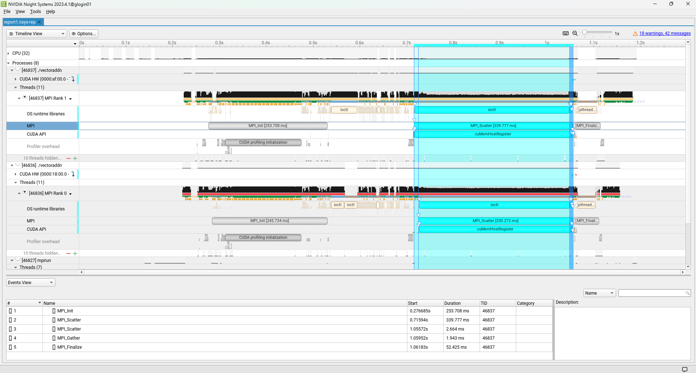
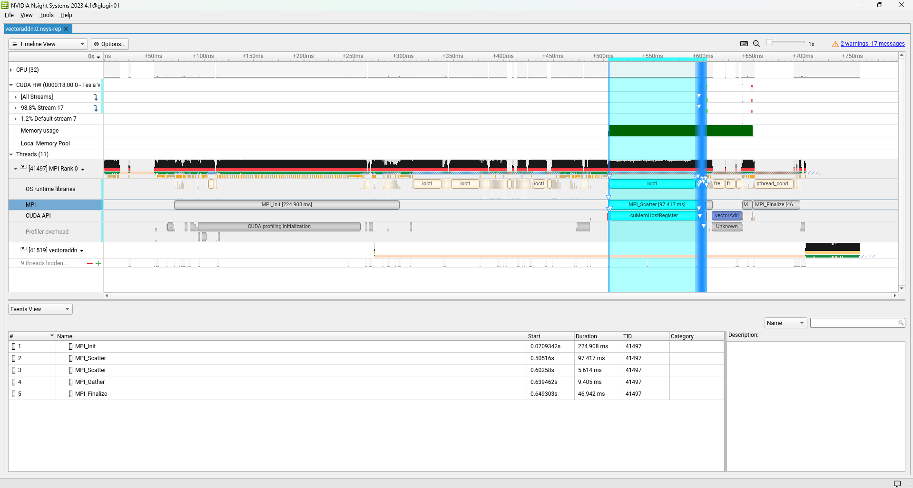
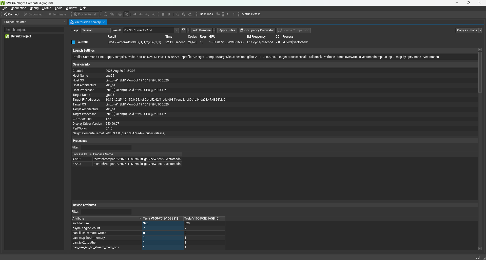
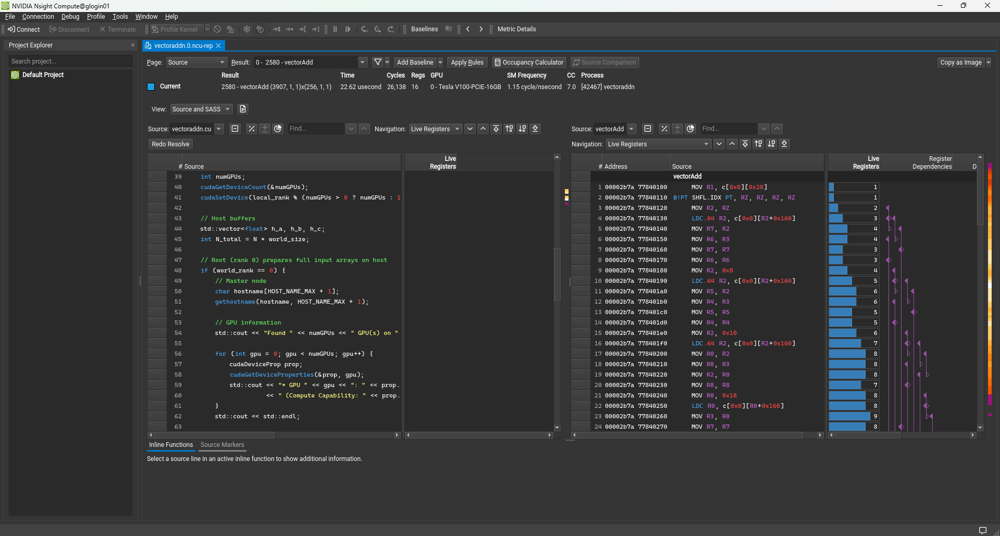

# NVIDIA GPU Profiling

&#x20;GPU Profiling은 성능을 측정하고 분석하여 병목 현상을 찾아내고 효율을 높이기 위한 과정으로 작업에서 소요하는 시간과 자원 사용 현황을 파악하고 병목이 발생하는 부분, 비효율적인 코드, 메모리 사용 문제 등을 식별할 수 있습니다.
\
&#x20;본 문서에서는 뉴론 시스템에서 NVIDIA Nsight System과 Nsight Compute 를 활용할 수 있는 방법에 대해 예시로 소개 드립니다.&#x20;


## 가. SLURM 스케줄러 옵션 설정

<mark style="color:red;">profiling 작업 시, 계산노드 설정 변경이 필요하므로 아래와 같이 --exclusive 옵션과 --constrain=hwperf 옵션을 추가로 입력해주어야 합니다.</mark>
\
\--exclusive은 노드를 전용으로 사용할 수 있는 옵션으로, 사용 가능한 노드가 확보될 때까지 대기시간이 다소 길어질 수 있습니다.

### 1. 인터렉티브 작업 제출 시

* 프로파일링 작업 시 포함해야 되는 옵션

```
--exclusive --constrain=hwperf
```

* 인터렉티브 작업 제출 예시&#x20;

```
$ salloc --partition=amd_a100nv_8 --exclusive --constrain=hwperf --comment=etc
```

### 2. 배치 작업 제출 시

* 프로파일링 작업 시 포함해야 되는 옵션

```
#SBATCH --exclusive 
#SBATCH --constrain=hwperf
```

* 작업 스크립트 설정 예시

```
#!/bin/bash
#SBATCH --comment=pytorch
#SBATCH --partition=amd_a100nv_8
#SBATCH --time=12:00:00        
#SBATCH --nodes=1            
#SBATCH --exclusive   
#SBATCH --constrain=hwperf    

(생략)
```


## 나. 환경설정

&#x20;NVIDIA HPC SDK 에는 nvcc 와 같은 컴파일러와 nsys, ncu 프로파일링 툴이 모두 설치되어 있습니다. 뉴론 시스템에는 NVIDIA HPC SDK가 설치되어 있으며 module 로 환경설정이 가능합니다.

* NVIDIA HPC SDK module 설정 예시

```
$ module purge
$ module load nvidia_hpc_sdk/24.1
```


## 다. 프로파일링 과정&#x20;

### 1. 실행코드 컴파일

* CUDA 코드 컴파일 예시&#x20;

```
$ nvcc -O2 -g -G -o vectoraddm vectoraddm.cu
```

* CUDA + MPI 코드 컴파일 예시&#x20;

```
$ nvcc -ccbin mpicxx -O2 -g -G -std=c++11 -o vectoraddn vectoraddn.cu
```

※ -g –G 옵션은 디버깅을 위한 옵션

※ 본 예시에서는 아래CUDA + MPI 코드를 컴파일 하므로 nvcc -ccbin mpicxx 로 컴파일 진행합니다.

* vectoradd 실행코드 예

```
#include <iostream>
#include <unistd.h>
#include <cstdio>
#include <vector>
#include <numeric>
#include <algorithm>
#include <mpi.h>
#include <cuda_runtime.h>

#define N 1000000

// Vector addition kernel
__global__ void vectorAdd(float* a, float* b, float* c, int n) {
    int idx = blockIdx.x * blockDim.x + threadIdx.x;

    if (idx < n) {
        c[idx] = a[idx] + b[idx];
    }
}

int main(int argc, char *argv[]) {
    // MPI initialization
	MPI_Init(&argc, &argv);

    int world_size = 0;
    int world_rank = 0;
    int local_rank = 0;

    MPI_Comm_size(MPI_COMM_WORLD, &world_size);
    MPI_Comm_rank(MPI_COMM_WORLD, &world_rank);

    // Map rank -> GPU on each node (local rank)
    MPI_Comm local_comm;

    MPI_Comm_split_type(MPI_COMM_WORLD, MPI_COMM_TYPE_SHARED, world_rank, MPI_INFO_NULL, &local_comm);
    MPI_Comm_rank(local_comm, &local_rank);
    MPI_Comm_free(&local_comm);

    int numGPUs;
    cudaGetDeviceCount(&numGPUs);
    cudaSetDevice(local_rank % (numGPUs > 0 ? numGPUs : 1));

    // Host buffers
    std::vector<float> h_a, h_b, h_c;
    int N_total = N * world_size;

    // Root (rank 0) prepares full input arrays on host
    if (world_rank == 0) {
        // Master node
        char hostname[HOST_NAME_MAX + 1];
        gethostname(hostname, HOST_NAME_MAX + 1);

        // GPU information
        std::cout << "Found " << numGPUs << " GPU(s) on " << hostname  << std::endl;

        for (int gpu = 0; gpu < numGPUs; gpu++) {
            cudaDeviceProp prop;
            cudaGetDeviceProperties(&prop, gpu);
            std::cout << "* GPU " << gpu << ": " << prop.name
                      << " (Compute Capability: " << prop.major << "." << prop.minor << ")" << std::endl;
        }
        std::cout << std::endl;

        // initialize host vector
        h_a.resize(N_total);
        h_b.resize(N_total);
        h_c.resize(N_total);

        std::iota(h_a.begin(), h_a.end(), 0.0f);
        std::fill(h_b.begin(), h_b.end(), 1.0f);
        std::fill(h_c.begin(), h_c.end(), 0.0f);
    }

    // Device buffers for local chunk
    float *d_a, *d_b, *d_c;

    cudaMalloc(&d_a, N * sizeof(float));
    cudaMalloc(&d_b, N * sizeof(float));
    cudaMalloc(&d_c, N * sizeof(float));

    // Scatter input from host buffers into device buffers
    MPI_Scatter(h_a.data(), N, MPI_FLOAT, d_a, N, MPI_FLOAT, 0, MPI_COMM_WORLD);
    MPI_Scatter(h_b.data(), N, MPI_FLOAT, d_b, N, MPI_FLOAT, 0, MPI_COMM_WORLD);

    // Kernel launch
    int threadsPerBlock = 256;
    int blocksPerGrid   = (N + threadsPerBlock - 1) / threadsPerBlock;

    vectorAdd<<<blocksPerGrid, threadsPerBlock>>>(d_a, d_b, d_c, N);

    // Synchronize all devices
    cudaDeviceSynchronize();

    // Gather results from device buffers into root's host array
    MPI_Gather(d_c, N, MPI_FLOAT, h_c.data(), N, MPI_FLOAT, 0, MPI_COMM_WORLD);

    // Debug
    if (world_rank == 0) {
        std::cout << "Results: C[] = A[] + B[]" << std::endl;
        /* std::for_each(h_a.begin(), h_a.end(), [](float num) { std::cout << num << " "; }); std::cout << std::endl;  */
        /* std::for_each(h_b.begin(), h_b.end(), [](float num) { std::cout << num << " "; }); std::cout << std::endl;  */
        /* std::for_each(h_c.begin(), h_c.end(), [](float num) { std::cout << num << " "; }); std::cout << std::endl;  */
        printf("A[0]=%.1f, A[%d]=%.1f\n", h_a[0], N_total-1, h_a[N_total-1]);
        printf("B[0]=%.1f, B[%d]=%.1f\n", h_b[0], N_total-1, h_b[N_total-1]);
        printf("C[0]=%.1f, C[%d]=%.1f\n", h_c[0], N_total-1, h_c[N_total-1]);
    }

    // Free GPU memory
    cudaFree(d_a);
    cudaFree(d_b);
    cudaFree(d_c);

    MPI_Finalize();

    return 0;
}
```

### 2. nsys 프로파일링

&#x20;nsys profile 은 Nsight Systems의 명령으로, 프로그램 전체 실행을 시간축으로 기록하는 프로파일러입니다. CPU, CUDA 커널/메모리, MPI/NCCL, OS 이벤트 등의 정보를 한 타임라인에 보여주기 때문에 어디서 많은 시간이 소비되는지 한 눈에 파악할 수 있습니다.

* 단일노드, 멀티 GPU 에서의 nsys profile 실행 명령, 옵션 예시

```
nsys profile \
-o vectoraddn \
--trace=cuda,mpi,osrt \
--cuda-memory-usage=true \
--stats=true \
--force-overwrite=true \
mpirun \
-np 2 \
-map-by ppr:2:node \
./vectoraddn
```

* 멀티노드, 멀티 GPU 에서의 nsys profile 실행 명령, 옵션 예시

```
mpirun \
-np 4 \
-map-by ppr:2:node \
nsys profile \
-o vectoraddn.%q{OMPI_COMM_WORLD_RANK} \
--trace=cuda,mpi,osrt \
--cuda-memory-usage=true \
--stats=true \
--force-overwrite=true \
./vectoraddn
```

* 특정 프로세스만 프로파일링

많은 프로세스로 실행되는 소프트웨어는 프로파일링 시 부하가 발생할 수 있으며 이런 경우 wrapper 스크립트를 작성하고, 특정 프로세스만 선택적으로 프로파일링 할 수 있습니다.

```
mpirun \
-np 4 \
-x NSYS_MPI_STORE_TEAMS_PER_RANK=1 \
-map-by ppr:2:node \
./nsys_wrapper.sh \
./vectoraddn
```

※ nsys profile 은일부 랭크만 프로파일링 시, mpirun 옵션에서-x NSYS\_MPI\_STORE\_TEAMS\_PER\_RANK=1 옵션 추가 입력 필요

* nsys\_wrapper.sh&#x20;

```
#!/usr/bin/env bash

TARGET=vectoraddn

if [[ $OMPI_COMM_WORLD_RANK == 0 ]]
then
    nsys profile \
        -o ${TARGET}.%q{OMPI_COMM_WORLD_RANK} \
        --trace=cuda,mpi,osrt \
        --cuda-memory-usage=true \
        --stats=true \
        --force-overwrite=true \
        "$@"
else
    "$@"
fi
```

### 3. ncu 프로파일링

&#x20;ncu 는 Nsight Compute의 명령으로, 특정 CUDA 커널 내부를 깊게 분석할 수 있는 프로파일러 입니다. SM 점유율, WARP 효율, 메모리 대역폭/캐시 등 세밀한 정보를 수집합니다. 커널이 왜 느린지 어떻게 튜닝할지 판단할 때 활용할 수 있는 도구입니다.

* 단일노드, 멀티 GPU

```
ncu \
-o vectoraddn \
--target-processes=all \
--call-stack \
--verbose \
--force-overwrite \
mpirun \
-np 2 \
-map-by ppr:2:node \
./vectoraddn
```

* 멀티노드, 멀티 GPU

```
mpirun \
-np 4 \
-map-by ppr:2:node \
ncu \
-o vectoraddn.%q{OMPI_COMM_WORLD_RANK} \
--target-processes=all \
--call-stack \
--verbose \
--force-overwrite \
./vectoraddn
```

* 특정 프로세스만 프로파일링

```
mpirun \
-np 4 \
-map-by ppr:2:node \
./ncu_wrapper.sh \
./vectoraddn
```

* ncu\_wrapper.sh

```
#!/usr/bin/env bash

TARGET=vectoraddn

if [[ $OMPI_COMM_WORLD_RANK == 0 ]]
then
    ncu \
        -o ${TARGET}.%q{OMPI_COMM_WORLD_RANK} \
        --target-processes=all \
        --call-stack \
        --verbose \
        --force-overwrite \
        "$@"
else
    "$@"
fi
```

### 4. nsys-ui 실행

nsys profile 실행 후 생성된 report 파일은은 nsys-ui 명령으로 GUI 환경에서 확인하실 수 있습니다.

* nsys-ui 실행

```
$ module purge
$ module load nvidia_hpc_sdk/24.1
$ nsys-ui vectoraddm.nsys-rep
```

※ 로그인 노드에서 실행하는 예시이며 X Window System 설정이 되어 있어야 합니다.
\
WindowsOS :
&#x20;SSH 클라이언트 프로그램 X11 Forwarding 설정, X서버 프로그램(Xming 또는 VcXsrv 등) 실행
\
MacOS :
&#x20;뉴론 접속 시 ssh -X 옵션으로 접속, X서버 프로그램(XQuartz) 실행

* 실행화면

<figure><figcaption></figcaption></figure>

<figure><figcaption></figcaption></figure>

### 5. ncu-ui 실행

ncu 실행 후 생성된 report 파일은 ncu-ui 명령으로 GUI 환경에서 확인하실 수 있습니다.

* ncu-ui 실행

```
$ module purge
$ module load nvidia_hpc_sdk/24.1
$ ncu-ui vectoraddm.ncu-rep
```

※ 로그인 노드에서 실행하는 예시이며 X Window System 설정이 되어 있어야 합니다.
\
WindowsOS :
&#x20;SSH 클라이언트 프로그램 X11 Forwarding 설정, X서버 프로그램(Xming 또는 VcXsrv 등) 실행
\
MacOS :
&#x20;뉴론 접속 시 ssh -X 옵션으로 접속, X서버 프로그램(XQuartz) 실행

* 실행화면

<figure><figcaption></figcaption></figure>

<figure><figcaption></figcaption></figure>


## 라. 참고&#x20;

* NVIDIA Nsight System User Guide :  [https://docs.nvidia.com/nsight-system
  ](https://docs.nvidia.com/nsight-system)
* NVIDIA Nsight Systems : [https://developer.nvidia.com/nsight-systems](https://developer.nvidia.com/nsight-systems)
* NVIDIA Nsight Compute : [https://developer.nvidia.com/nsight-compute](https://developer.nvidia.com/nsight-compute)
