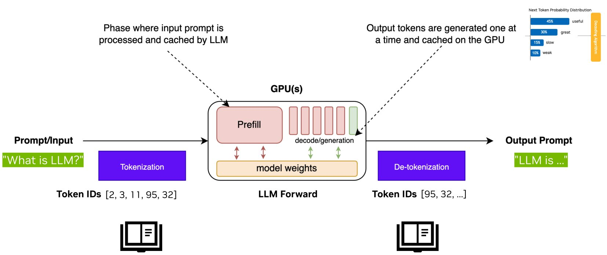
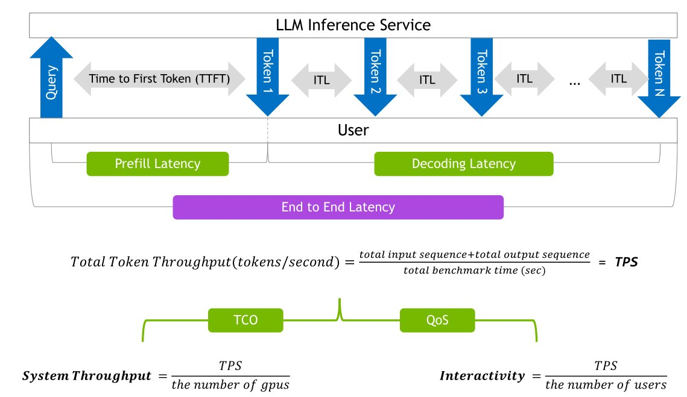
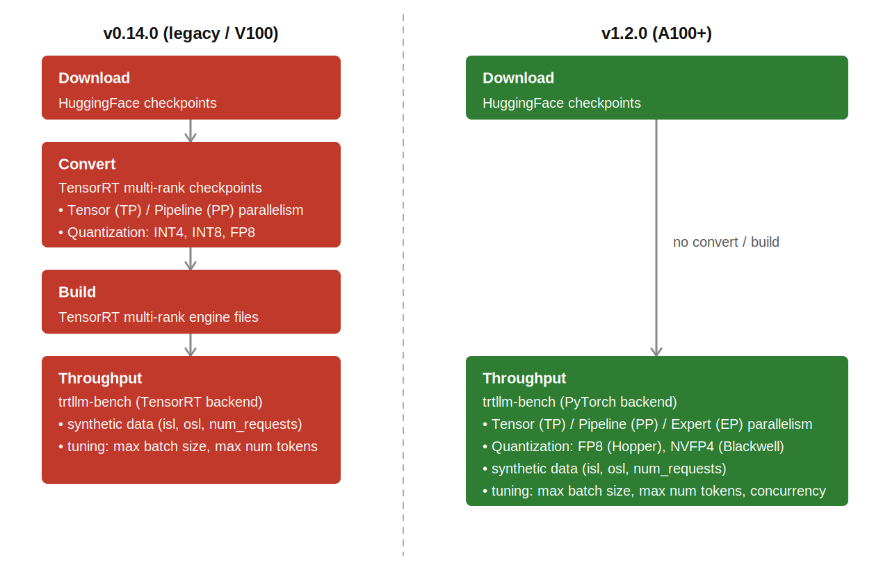
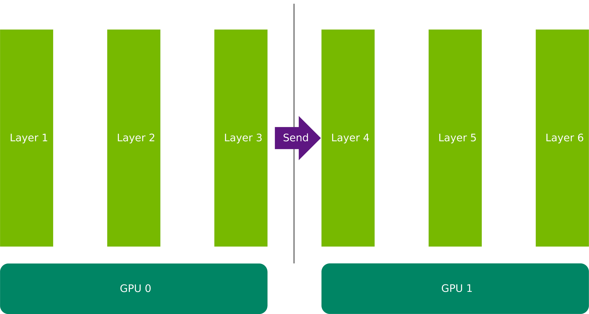
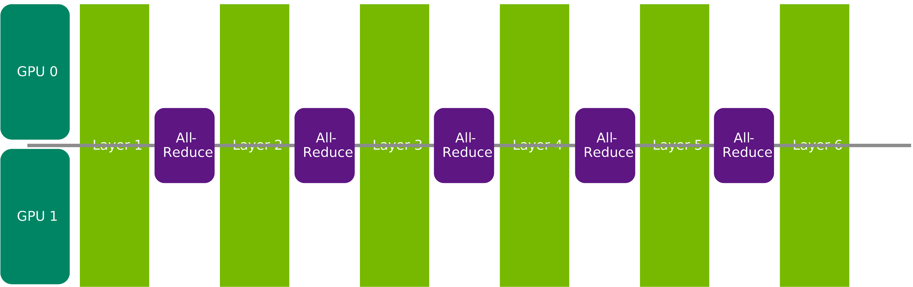
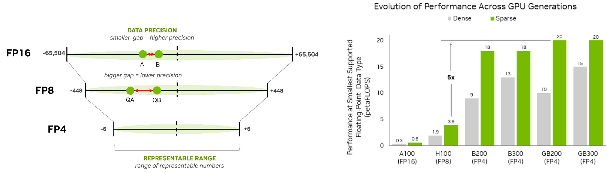
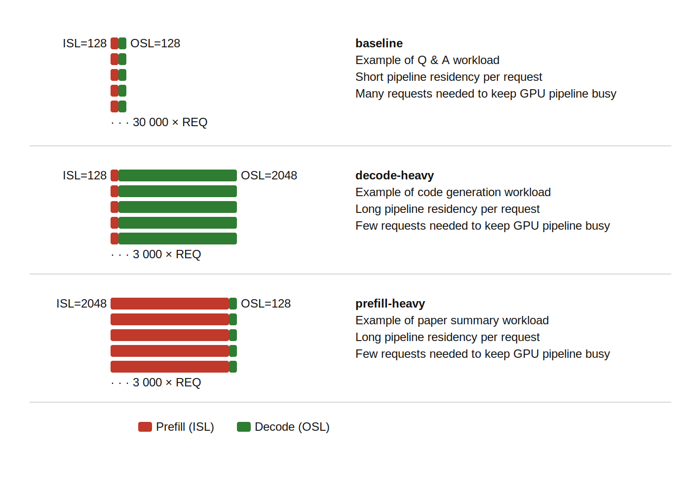

# TensorRT-LLM 추론 성능 벤치마크

본 페이지에서는 KISTI에서 측정한 NVIDIA TensorRT-LLM 프레임워크의 LLM 추론 성능 벤치마크 결과를 제공합니다.

&#x20;A100 SXM 80GB를 포함한 다양한 NVIDIA GPU 환경에서 Llama-3.1-8B-Instruct 등 주요 오픈소스 모델을 대상으로, FP16·FP8 등 정밀도 설정과 다양한 입출력 시퀀스
&#x20;길이(ISL/OSL) 조합에 따른 처리량(tokens/sec)을 측정하였습니다.&#x20;

결과는 본 페이지의 [벤치마크 결과](tensorrt-llm.md#result) 또는 인터랙티브 필터를 적용시킨 [웹페이지](https://vitduck.github.io/KISTI-llmbench)에서 GPU, 모델, 정밀도, 시퀀스 길이 조합별 성능을 직접 비교해 볼 수 있습니다.&#x20;

***

## LLM 추론의 동작 원리

<figure><figcaption></figcaption></figure>

사용자가 "What is LLM?"이라는 질문을 입력하면, 모델은 이를 즉시 이해하는 것이 아니라 네 단계의 파이프라인을 거쳐 응답을 생성합니다.

* **토크나이제이션(Tokenization)**: 입력 문장을 사전에 정의된 어휘 사전을 통해 Token ID 시퀀스로 변환합니다. 예를 들어 "What is LLM?"은 `[2, 3, 11, 95, 32]`와 같은 숫자 배열이 됩니다.
* **프리필(Prefill)**: 변환된 토큰 전체를 한꺼번에 처리하여 문장 전체의 문맥을 파악합니다. 대규모 행렬 연산을 수반하는 compute-intensive 단계로, GPU의 연산 능력이 집중적으로 요구됩니다.
* **디코딩(Decoding)**: 앞서 파악한 문맥을 바탕으로 출력 토큰을 하나씩 순차적으로 예측합니다. 프리필과 달리 GPU의 메모리 대역폭(memory bandwidth)이 병목이 되는 구간입니다.
* **디토크나이제이션(Detokenization)**: 생성된 Token ID 시퀀스를 다시 사람이 읽을 수 있는 자연어 문장으로 변환하여 응답을 완성합니다.

### 어텐션 메커니즘

모델이 단순한 토큰 나열에서 의미 있는 문맥을 파악할 수 있는 비결은 **어텐션 메커니즘**에 있습니다. 모델은 각 입력 토큰에 대해 서로 다른 가중치를 통해 세 가지 벡터를 생성합니다.

* **쿼리(Query)**: 현재 토큰이 다른 토큰들과 어떤 관계를 맺는지 묻는 역할을 합니다.
* **키(Key)**: 각 토큰의 핵심 식별 정보를 담아, 쿼리가 참조할 수 있는 색인 역할을 합니다.
*   **밸류(Value)**: 토큰에 담긴 실제 의미 정보를 표현합니다.

    쿼리와 키 사이의 닷 프로덕트(dot product)로 어텐션 스코어를 산출하고, 이를 가중치로 삼아 밸류 벡터들의 가중합을 계산합니다. 그 결과 문장 전체의 문맥이 풍부하게 반영된 새로운 토큰 표현이 만들어집니다. 프리필 단계는 이 연산을 입력 시퀀스 전체에 대해 한꺼번에 수행하기 때문에 계산 집약적이고, 디코딩 단계는 매 토큰 생성 시마다 앞선 연산 결과에 반복 접근하기 때문에 메모리 대역폭에 민감한 성격을 띱니다.

***

## 성능 지표: 레이턴시와 스루풋

<figure><figcaption></figcaption></figure>

LLM 추론 성능은 **레이턴시(Latency)** 와 **스루풋(Throughput)** 두 관점으로 평가합니다. 레이턴시는 개별 요청의 응답 속도를, 스루풋은 시스템 전체의 처리 효율을 나타냅니다.

레이턴시를 구성하는 핵심 지표는 다음 세 가지입니다.

* **TTFT (Time to First Token)**: 요청 후 첫 번째 토큰이 도착하기까지의 시간으로, 프리필 레이턴시와 직결됩니다. 사용자가 느끼는 시스템의 초기 반응성을 나타내며 SLA 설계의 핵심 기준이 됩니다.
* **ITL (Inter-Token Latency)**: 연속 출력 토큰 간의 생성 간격으로, 스트리밍 서비스에서 사용자가 체감하는 타이핑 속도에 해당합니다. 자연스러운 대화 흐름을 위해 사용자의 읽기 속도보다 빨라야 합니다.
* **End-to-End Latency**: 프리필과 디코딩 레이턴시를 합산한 값으로, 하나의 응답이 완전히 완성되기까지의 전체 시간입니다.
* **TPS(Tokens Per Second)**  초당 처리하는 총 토큰 수인 측정합니다. TPS를 GPU 수로 나누면 GPU당 비용 효율(TCO), 사용자 수로 나누면 개별 사용자 체감 응답성(QoS)으로 해석됩니다. 동일한 TPS라도 서비스 목표에 따라 최적화 방향은 달라집니다.

***

## TensorRT-LLM: NVIDIA의 핵심 추론 엔진

TRT-LLM은 NVIDIA GPU에서 LLM 추론 성능을 극대화하기 위해 설계된 고성능 오픈소스 라이브러리입니다. 초기 버전에서는 HuggingFace 체크포인트를 TensorRT 엔진으로 변환·빌드하는 복잡한 절차가 필요했지만, v1.0부터 도입된 PyTorch 네이티브 워크플로우 덕분에 변환 없이 HuggingFace 모델을 그대로 사용할 수 있게 되었습니다. 내부 구조는 Python으로 모듈화되어 스케줄러 같은 핵심 컴포넌트를 커스터마이징할 수 있으며, 전체 코드가 오픈소스로 공개되어 있습니다.

가장 최근 릴리즈인 **v1.2.0** 에서는 다음과 같은 개선이 이루어졌습니다.

* **하드웨어 지원 확장**: Blackwell B300/GB200/GB300을 포함한 최신 아키텍처로 지원이 확대되었습니다.
* **저정밀도 기능 강화**: FP8, NVFP4, MXFP4, INT4-AWQ 등 다양한 양자화 옵션이 대폭 보강되었습니다.
* **기존 모델 개선**: DeepSeek v3.2, KimiK2, Mistral Large 3, Qwen3의 안정성과 검증 범위가 강화되었습니다.
* **신규 모델 지원 (Beta)**: K-EXAONE, Nemotron Nano V3, Qwen3-Next, Qwen3-VL이 새롭게 추가되었습니다.

***

## 워크플로우 비교: Legacy (V100) vs. PyTorch (A100+)

TRT-LLM의 워크플로우는 v0.15.0을 기점으로 크게 달라졌습니다. v0.15.0부터 V100 지원이 공식 종료되면서, 이전 버전에서 요구되던 TensorRT 기반의 복잡한 빌드 절차가 PyTorch 네이티브 방식으로 대체되었습니다.

<figure><figcaption></figcaption></figure>

### **레거시 워크플로우 (v0.14.0 이하 / V100)**

좌측은 V100을 지원하는 마지막 버전인 v0.14.0까지의 TensorRT 기반 워크플로우입니다. HuggingFace 체크포인트를 다운로드한 후, 별도의 Convert 단계에서 텐서·파이프라인 병렬화 설정과 양자화(INT4, INT8, FP8)를 적용하여 TensorRT 멀티-랭크 체크포인트를 생성합니다. 이어지는 Build 단계에서는 이를 TensorRT 엔진 파일로 컴파일합니다. 이 두 사전 작업을 마친 후에야 TensorRT 백엔드 기반의 `trtllm-bench`로 스루풋 벤치마크를 실행할 수 있었습니다. 모델이나 설정이 바뀔 때마다 Convert와 Build를 처음부터 반복해야 한다는 점에서 반복 실험 비용이 높았습니다.

### **현대 워크플로우 (v1.0 이상 / A100+)**

우측은 v1.0부터 도입된 PyTorch 기반 워크플로우입니다. Convert와 Build 단계가 완전히 제거되어, HuggingFace 체크포인트에서 곧바로 PyTorch 백엔드 기반의 `trtllm-bench`로 진입합니다. TP·PP·EP 병렬화, Hopper의 FP8 및 Blackwell의 NVFP4 양자화를 네이티브로 지원하며, 동시성(concurrency) 제어를 포함한 확장된 튜닝 파라미터를 제공합니다. 설정 변경 후 즉시 재실행이 가능해 반복 실험 효율이 크게 향상되었습니다.

***

## 멀티-GPU 최적화: 파이프라인 병렬 vs. 텐서 병렬

대형 모델은 단일 GPU 메모리를 초과하는 경우가 많아 가중치를 여러 GPU에 분산하는 샤딩(Sharding)이 필요합니다. 샤딩 전략의 선택은 추론 성능에 직접적인 영향을 미치며, 핵심 판단 기준은 **GPU 간 통신 오버헤드** 입니다. TRT-LLM에서 `tensor_parallel_size × pipeline_parallel_size` 는 반드시 전체 GPU 수(world size)와 일치해야 합니다.

### 파이프라인 병렬 (Pipeline Parallelism, PP=2)

<figure><figcaption></figcaption></figure>

파이프라인 병렬은 모델의 레이어를 연속된 그룹으로 나누어 GPU에 순서대로 할당합니다. PP=2, 6개 레이어 모델을 예로 들면 GPU 0은 Layer 1\~3을, GPU 1은 Layer 4\~6을 담당합니다. GPU 0이 연산을 마치면 그 출력인 활성화 값(activation)을 GPU 1로 `Send`하고, GPU 1이 이를 이어받아 나머지 레이어를 처리합니다. 통신은 인접 GPU 간의 일방향 전송만 발생하므로 오버헤드가 가볍습니다.

### 텐서 병렬 (Tensor Parallelism, TP=2)

<figure><figcaption></figcaption></figure>

텐서 병렬은 각 레이어의 가중치 행렬을 GPU에 분할하여 모든 GPU가 동시에 같은 레이어를 처리합니다. TP=2, 6개 레이어 모델에서는 GPU 0과 GPU 1이 모든 레이어의 가중치를 절반씩 나누어 보유하며 병렬로 연산합니다. 각 GPU의 결과는 레이어의 부분합이므로, 다음 레이어로 진행하기 전에 모든 GPU가 참여하는 **All-Reduce** 로 합산해야 합니다. 반면 GPU당 행렬 크기가 줄어들어 레이어당 연산은 빨라집니다. 결국 All-Reduce의 통신 비용과 연산 가속의 이득 간의 균형이 TP의 실효성을 결정하며, NVLink와 같은 고속 인터커넥트가 이 조건을 충족시키는 핵심 요소입니다.

### 병렬화 전략 구성

최적 전략은 인터커넥트 대역폭에 따라 결정됩니다.

* **단일 GPU**: 샤딩이 불필요한 경우 통신 오버헤드 없이 운용하는 것이 최선입니다.
* **단일 노드 멀티-GPU**: TP가 일반적으로 유효한 선택입니다. NVLink가 없는 경우 PP도 검토하되, TP를 먼저 시도하여 성능을 확인하는 것이 권장됩니다.
* **멀티-노드**: 노드 간 인터커넥트는 NVLink 대비 대역폭이 낮아 All-Reduce가 병목이 됩니다. **노드 내 TP, 노드 간 PP** 의 혼합 전략이 권장되며, 각 노드에 16개 GPU가 있는 2노드 환경에서는 `TP=8, PP=2` 가 전형적인 출발점입니다.
* **NVL36 / NVL72 Blackwell**: 노드 경계를 넘어서도 NVLink로 연결되므로, 36개 또는 72개 GPU 범위 내에서는 멀티-노드 환경에서도 TP 단독 운용이 가능합니다.

***

## FP8 양자화: Hopper Tensor Core 활용

<figure><figcaption></figcaption></figure>

Tensor Core는 `D = A × B + C` 형태의 행렬 곱-누적(MMA) 연산을 전용 하드웨어에서 가속하는 실행 유닛으로, CUDA Core 대비 8\~64배 빠르고 에너지 효율도 높습니다. LLM 추론의 핵심 연산인 대형 행렬 곱셈이 모두 이 위에서 동작하기 때문에, 어떤 정밀도를 Tensor Core가 지원하느냐는 양자화 전략의 범위를 직접 결정합니다.

V100은 Tensor Core에서 FP16만 지원합니다. 이는 활성화 값(activation)도 FP16으로 처리되어야 함을 의미하며, 가중치만 낮은 정밀도로 압축하는 **가중치 전용 양자화(weight-only quantization)** 만 현실적으로 가능합니다. TRT-LLM에서 V100이 지원하는 대표적인 방식은 W4A16으로, 가중치를 INT4로 압축하되 연산 시에는 FP16으로 복원하여 Tensor Core에 입력합니다. 메모리 절감 효과는 있지만, 연산 자체는 여전히 FP16 정밀도로 수행되므로 Tensor Core의 처리 속도를 최대한 끌어올리기 어렵습니다.

Hopper(H200) 아키텍처는 FP8 Tensor Core를 도입하여 이 한계를 극복합니다. FP8은 세 가지 측면에서 추론 성능을 향상시킵니다.

* **연산 가속**: FP8 Tensor Core는 FP16 Tensor Core 대비 2배 빠른 처리 속도를 제공합니다. 가중치와 활성화 값 모두 FP8로 처리할 수 있어 Tensor Core의 처리량을 최대한 활용할 수 있습니다.
* **메모리 효율**: 8비트는 16비트의 절반 크기이므로, 동일한 데이터를 접근하는 데 필요한 메모리 트래픽이 절반으로 줄어듭니다. 디코딩 단계처럼 메모리 대역폭이 병목인 구간에서 특히 효과적입니다.
* **배포 효율**: 현재 많은 모델이 FP8로 사전 학습되거나 변환된 상태로 배포되고 있어, 추가적인 양자화 변환 없이 빠른 추론 배포가 가능합니다.

Hopper의 FP8이 확립한 이 패턴은 다음 세대인 Blackwell에서 더욱 발전됩니다. NVIDIA의 Blackwell 아키텍처(B100/B200, GB200)는 Blackwell Tensor Core에 네이티브한 4비트 부동소수점 포맷인 NVFP4를 도입합니다. FP8의 절반 비트폭으로 메모리 대역폭 효율을 추가로 두 배 향상시키고 더 높은 Tensor Core 처리량을 제공합니다. Hopper의 FP8과 마찬가지로 NVFP4는 가중치와 활성화 값 모두에 적용되어 가중치 전용 방식이 아닌 완전한 연산 양자화(compute quantization)로 동작합니다. TRT-LLM v1.2.0은 Blackwell을 위한 NVFP4 네이티브 지원을 포함합니다.

<figure><figcaption></figcaption></figure>

부동소수점 양자화는 근본적인 트레이드오프를 수반합니다. FP16에서 FP8, FP4로 비트폭이 줄어들수록 표현 가능한 수의 범위가 좁아지고 인접 값 간의 간격이 커져 값당 정밀도가 낮아집니다. 이 압축이 높은 연산 처리량과 메모리 트래픽 감소를 가능하게 하는 핵심 메커니즘입니다.

이 트레이드오프는 GPU 세대별 하드웨어 성능 향상으로 직결됩니다. 각 아키텍처가 지원하는 최소 부동소수점 타입 기준의 petaFLOPS로 측정하면, A100(FP16)의 0.3/0.6(dense/sparse)에서 H100(FP8)의 1.9/3.9로, 그리고 Blackwell B200/B300/GB200/GB300(FP4)에서는 최대 20 petaFLOPS(sparse)에 도달합니다. H100에서 B200만으로도 약 5배의 성능 향상이 이루어지며, 이는 세대마다 채택된 정밀도 포맷이 추론 처리량의 핵심 동인임을 보여줍니다.

### 벤치마크 파라미터: ISL, OSL, REQ

<figure><figcaption></figcaption></figure>

TRT-LLM 벤치마크는 입력 시퀀스 길이(ISL), 출력 시퀀스 길이(OSL), 요청 수(REQ) 세 가지 파라미터로 워크로드를 정의합니다. 합성 데이터셋은 `prepare_dataset.py` 스크립트로 생성하며, 모든 요청은 균일하게 구성됩니다. 입력과 출력 시퀀스 길이의 표준편차는 모두 0으로 고정되어 재현 가능한 벤치마크 조건을 보장합니다. ISL/OSL이 짧은 구성에서는 요청이 시스템을 빠르게 통과하므로 안정 상태(steady state)에 도달하기 위해 더 많은 REQ가 필요하며, 시퀀스가 길수록 요청이 시스템에 더 오래 머물기 때문에 더 적은 수로도 충분합니다.

KISTI 테스트는 세 가지 대표 구성을 사용합니다.

* **baseline (ISL=128, OSL=128, REQ=30,000)**: 프리필과 디코딩이 균형 잡힌 짧은 요청으로, Q\&A 워크로드를 대표합니다. GPU 파이프라인을 포화 상태로 유지하기 위해 높은 요청 수가 필요합니다.
* **decode-heavy (ISL=128, OSL=2048, REQ=3,000)**: 요청당 긴 디코딩 구간을 가지며, 코드 생성 워크로드를 대표합니다.
* **prefill-heavy (ISL=2048, OSL=128, REQ=3,000)**: 요청당 긴 프리필 구간을 가지며, 문서 요약 워크로드를 대표합니다.

***

## 벤치마크 결과 

### 하드웨어 및 모델

벤치마크는 KISTI Neuron 시스템에서 사용 가능한 다섯 가지 GPU 구성을 대상으로 수행되었습니다: V100 PCIe 32GB, V100 SXM, A100 SXM, H200 SXM, GH200. 이는 Volta, Ampere, Hopper 세 GPU 세대에 걸쳐 있으며, 표준 PCIe 및 고대역폭 SXM 폼 팩터를 모두 포함합니다.

두 가지 모델 계열을 테스트하였습니다. 첫 번째는 Meta의 네이티브 Llama 3.1 시리즈(8B 및 70B Instruct)로, FP16 정밀도로 실행됩니다. 두 번째는 동일 모델의 NVIDIA 사전 양자화 FP8 변형(8B, 70B, 405B Instruct-FP8)으로 배포됩니다. 이 체크포인트는 FP8로 사후 양자화되어 있어 Hopper GPU에서 추가적인 양자화 과정 없이 바로 배포할 수 있습니다. 405B 모델은 FP8 변형으로만 제공되며, 네이티브 FP16 가중치는 이 규모에서 실용적인 GPU 메모리 용량을 초과합니다.

### 세대별 GPU 성능 비교

<figure><figcaption></figcaption></figure>

### FP16 vs. FP8 양자화 효과

<figure><figcaption></figcaption></figure>

### 텐서 병렬 성능

<figure><figcaption></figcaption></figure>

***

※ 아래 웹 페이지에서 상세 결과를 확인하실 수 있습니다.


