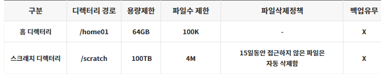

# 사용자 환경

## 가. 계정발급

### 1. 뉴론(NEURON) 시스템의 사용을 승인받은 연구자는 KISTI 국가슈퍼컴퓨팅센터 홈페이지(https://www.ksc.re.kr) 웹 서비스를 통해 계정을 신청합니다.

#### 1) 신청 방법 : KISTI 홈페이지 웹사이트접속, (상단) 사용신청 -> (상단) 신청 -> 신청서선택

* 무료계정 : 누리온 시스템 혁신지원 프로그램, 초보사용자
* 유료계정 : 일반사용자, 학생사용자
* 계정 발급 완료 시 신청서에 기입한 이메일로 계정 관련 정보 발송

#### 2) OTP (One Time Password, 일회용 비밀번호) 인증코드 발급

* **수신하신 계정 정보 이메일을 참고하여** 아래와 같이 작성하여 account@ksc.re.kr을 통해 인증코드를 발급 받습니다.

| 메일 제목    | <p>OTP 인증코드 발송 요청 - 사용자 ID</p><p>(예) OTP 인증코드 발송 요청 - x123abc</p>                             |
| -------- | --------------------------------------------------------------------------------------------- |
| 수신인      | account@ksc.re.kr                                                                             |
| 메일내용(예제) | <p>로그인 ID: x123abc</p><p>휴대폰번호: 010-1234-5678</p><p>이름: 홍길동</p><p>통신사: LG 유플러스(or SKT/KT)</p> |

#### 3) OTP 앱 설치

* 슈퍼컴퓨팅 보안 접속을 위해 OTP 스마트폰 앱이 제공됩니다.
* OTP 스마트폰 앱은 안드로이드 앱 스토어(Google Play)나 아이폰 앱 스토어(App Store)에서 “Any OTP”로 검색 후 미래기술(mirae-tech)에서 개발한 앱을 설치하여 사용할 수 있습니다.
* 슈퍼컴퓨터 로그인 시 “Any OTP” 앱의 OTP 보안숫자를 반드시 입력해야 합니다.

※ 스마트폰을 사용하고 있지 않은 사용자의 경우, 계정담당자(account@ksc.re.kr)에게 문의 부탁드립니다.

※ 자세한 OTP 설치 및 이용방법은 KISTI 홈페이지 > 기술지원 > 지침서에서 “OTP 사용자 매뉴얼” 참조 바랍니다.

※ LG 유플러스의 경우에는 문자가 스팸처리되므로 이메일로 안내 드립니다.


## 나. 로그인

* 사용자는 뉴론 시스템 로그인 노드(neuron01.ksc.re.kr, neuron02.ksc.re.kr, neuron03.ksc.re.kr)를 통해서 접근이 가능합니다. (하단,  노드 구성 참조).

※ 웹 브라우저를 통해 MyKSC(KISTI 슈퍼컴퓨터 웹 서비스 포털, https://my.ksc.re.kr)에 로그인하여 GUI 기반의 HPC 및 AI/데이터분석 서비스를 활용할 수 있습니다 (사용법은 [MyKSC  지침서](https://docs-ksc.gitbook.io/myksc-2.0-beta-service) 참조)

* 기본 문자셋(encoding)은 유니코드(UTF-8)입니다.
* 로그인 노드에 대한 접근은 ssh, scp, sftp, X11 만 허용됩니다.

### 1. 유닉스 또는 리눅스 환경

```shell-session
$ ssh -l <사용자ID> neuron01.ksc.re.kr -P 22
```

* \[-P 22]: 포트번호 명시를 위한 것으로 생략 가능
* X환경 실행을 위해 XQuartx 터미널을 이용합니다.

※ 프로그램은 인터넷을 통해 무료로 다운로드 후 설치하실 수 있습니다.


### 2. 윈도우 환경

* X환경 실행을 위해 Xming 실행

※ 프로그램은 인터넷을 통해 무료로 다운로드 후 설치하실 수 있습니다.

.png>)

* putty, Mobaxterm, 또는 SSH Secure Shell Client 등의 ssh 접속 프로그램을 이용합니다.
  * Host Name : neuron.ksc.re.kr, Port : 22, Connection type : SSH

※ 프로그램은 인터넷을 통해 무료로 다운로드 가능합니다.


* ssh -> X11 tap -> check “Enable X11 forwarding”
* X display location : localhost:0.0


※ 만약, DNS 캐싱 문제로 접속이 안 될 경우에는 캐시를 정리 (명령 프롬프트에서 ipconfig /flushdns 명령어 수행)하고 재접속 합니다.

```shell-session
C:￦> ipconfig /flushdns
```

### 3. 파일 송수신

* FTP 클라이언트를 통해 ftp(OTP 없이 접속가능)나 sftp로 접속하여 파일을 송수신 합니다.

```shell-session
$ ftp neuron-dm.ksc.re.kr
또는
$ sftp [사용자ID@]neuron-dm.ksc.re.kr [-P 22]
```

* 윈도우 환경에서는 WinSCP와 같이 무료로 배포되고 있는 FTP/SFTP 클라이언트 프로그램을 이용하여 접속합니다.


* FTP (File Tranfer Protocal)을 이용하며, OTP를 입력하지 않고 파일 전송 가능합니다.
* SFTP(Secure-FTP) 을 이용하며, 파일 전송시 OTP를 입력해야 합니다.(FTP보다 안전한 전송방식)

### 4. 노드구성

<table><thead><tr><th width="146" align="center">노드</th><th width="189" align="center">호스트명</th><th width="145" align="center">CPU Limit</th><th align="center">비고</th></tr></thead><tbody><tr><td align="center">로그인 노드</td><td align="center"><p>neuron.ksc.re.kr</p><p><em>(</em>neuron01.ksc.re.kr, neuron02.ksc.re.kr, neuron03.ksc.re.kr)</p></td><td align="center">2시간</td><td align="center"><p>• ssh/scp 접속 가능</p><p>• 컴파일 및 batch 작업제출용</p><p>• ftp/sftp 접속 불가</p></td></tr><tr><td align="center">Datamover 노드</td><td align="center">neuron-dm.ksc.re.kr</td><td align="center">-</td><td align="center"><p>• ssh/scp/sftp/ftp 접속 가능</p><p>• 컴파일 및 작업제출 불가</p></td></tr></tbody></table>


* 로그인노드 상세 사양

#### 1) AMD 노드

* 호스트명 : neuron01.ksc.re.kr, neuron03.ksc.re.kr
* CPU : AMD EPYC 7543 2socket
* 메모리 : 512GB
* GPU : NVIDIA A100 2ea&#x20;

#### 2) Intel 노드

* 호스트명 : neuron02.ksc.re.kr
* CPU : Intel Xeon Gold 5217 2socket
* 메모리 : 384GB
* GPU : NVIDIA V100 1ea

※ DM 노드에는 Nurion의 홈디렉터리(/nurion\_home01/\[userid])와 스크래치디렉터리(/nurion\_scratch/\[userid])가 마운트되어 있어서 두 시스템에서 동일 userid를 사용할 경우 시스템 간 파일 이동이 가능합니다.

※ wget, git을 이용한 다운로드 및 대용량 데이터의 전송은 CPU Limit이 없는 Datamover 노드를 사용할 것을 권장합니다. (로그인 노드에서 수행 시에 CPU Limit에 따라 전송 중에 끊어질 수 있습니다.)

### <mark style="color:red;">5. 디버깅 노드 제공</mark>

* <mark style="color:red;">디버깅, 컴파일, 수행코드 테스트 등의 목적으로 2개의 GPU 노드 제공(실제 작업 수행은 제한)합니다.</mark>
* <mark style="color:red;">각 노드당 2개의 CPU(Xeon2.9GHz/32Cores)와 2개의 GPU(V100)가 장착되어 있습니다.</mark>
* <mark style="color:red;">로그인 노드(glogin\[01.02])에서 ssh로 직접 접속 가능하며(ssh gdebug01 또는 gdebug02), 스케줄러를 통한 서비스는 더 이상 지원하지 않습니다.</mark>


## 다. 사용자 쉘(shell) 변경

* 뉴론 시스템의 로그인 노드는 기본 쉘로 bash이 제공됩니다. 다른쉘로 변경하고자 할 경우 chsh 명령어를 사용합니다.

```shell-session
$ chsh
```

* 현재 사용 중인 쉘을 확인하기 위해서 echo $SHELL을 이용하여 확인합니다.

```shell-session
$ echo $SHELL
```

* 쉘의 환경설정은 사용자의 홈 디렉터리에 있는 환경설정 파일(.bashrc, .cshrc 등)을 수정하여 사용하면 됩니다.


## 라. 사용자 비밀번호 변경

* 사용자 패스워드를 변경하기 위해서는 로그인 노드에서 passwd 명령을 사용합니다.

```shell-session
$ passwd
```

※ 패스워드 관련 보안 정책

* 사용자 패스워드 길이는 최소 9자이며, 영문, 숫자, 특수문자의 조합으로 이뤄져야 합니다. 영문 사전 단어는 사용이 불가합니다.
* 사용자 패스워드 변경 기간은 2개월로 설정(60일) 됩니다.
* 새로운 패스워드는 최근 5개의 패스워드와 유사한 것을 사용 할 수 없습니다.
* 최대 로그인 실패 허용 횟수 : 5회
  * 5회 이상 틀릴 경우, 이 계정의 ID는 lock이 걸리므로, 계정담당자(acccount@ksc.re.kr)에게 문의해야 합니다.
  * 같은 PC에서 접속을 시도하여 5회 이상 틀릴 경우, 해당 PC의 IP 주소는 일시적으로 block 되므로 이 경우에도 계정담당자(account@ksc.re.kr)에게 문의해야 합니다.
* OTP 인증오류 허용 횟수 : 5회
  * 5회 이상 틀릴 경우, 계정담당자(account@ksc.re.kr)에게 문의해야 합니다.


## 마. 제공 시간

<table><thead><tr><th width="177" align="center">파티션명(CPU종류_GPU종류_GPU개수)</th><th width="170.390625" align="center">노드명</th><th align="center">노드 과금 요율</th></tr></thead><tbody><tr><td align="center"><a data-footnote-ref href="#user-content-fn-1">cas_v100nv_8</a></td><td align="center">gpu[01-02,04-05]</td><td align="center">0.24992</td></tr><tr><td align="center">cas_v100nv_4</td><td align="center">gpu[06-08]</td><td align="center">0.14263</td></tr><tr><td align="center">cas_v100_4</td><td align="center">gpu[10-20]</td><td align="center">0.14263</td></tr><tr><td align="center">cas_v100_2</td><td align="center">gpu[25,26,29]</td><td align="center">0.08312</td></tr><tr><td align="center">amd_a100_4</td><td align="center">gpu[44,45]</td><td align="center">0.19951</td></tr><tr><td align="center">amd_a100nv_8</td><td align="center">gpu[33-35-39-43]</td><td align="center">0.33336</td></tr><tr><td align="center">eme_h200nv_8</td><td align="center">gpu[46-50]</td><td align="center">0.90848</td></tr><tr><td align="center">gh200_1</td><td align="center">gpu[51-52]</td><td align="center">0.11354</td></tr><tr><td align="center">amd_h200nv_8</td><td align="center">gpu[53-56]</td><td align="center">0.90848</td></tr><tr><td align="center">amd_h100_2</td><td align="center">gpu[57-58]</td><td align="center">0.18506</td></tr><tr><td align="center">cpu</td><td align="center">cpu[01-06]</td><td align="center">0.02112</td></tr><tr><td align="center">bigmem</td><td align="center">bigmem01</td><td align="center">0.0432</td></tr><tr><td align="center"></td><td align="center">bigmem02</td><td align="center">0.01624</td></tr><tr><td align="center"></td><td align="center">bigmem03</td><td align="center">0.0324</td></tr><tr><td align="center"></td><td align="center">bigmem04</td><td align="center">0.02832</td></tr></tbody></table>

**※ 공유 노드 정책으로 인하여 작업이 사용한 core, gpu 개수만큼 과금 부과됩니다.**

**※ 최신 요금 정보는 요금계산기 (https://www.ksc.re.kr/jwjg/gjbg/yggsg) 참고 바랍니다.**


## 바. 작업 디렉터리 및 쿼터 정책

* 홈 디렉터리 및 스크래치 디렉터리에 대한 정보는 아래와 같습니다.



**\* NEURON시스템은 백업을 지원하지 않습니다.**

* 홈 디렉터리는 용량 및 I/O 성능이 제한되어 있기 때문에, 모든 계산 작업은 스크래치 디렉터리인 /scratch의 사용자 작업 공간에서 이루어져야 합니다.
* 사용자 디렉터리 용량 확인 (login 노드에서 실행)

```shell-session
$ quotainfo
```

* 파일 삭제 정책은 파일 속성 중 atime을 기준으로 적용됩니다.
  * atime(Access timestamp): 마지막 접근 시간&#x20;
  * mtime(Modified timestamp): 파일의 마지막 변경 시간 의미&#x20;
  * ctime(Change timestamp):파일의 퍼미션, 소유자, 링크 등에 의한 inode 변경 시간 의미

<mark style="color:red;">※ 삭제 정책(15일동안 접근하지 않은 파일은 자동 삭제함)에 따라 삭제된 파일의 복구는 기본적으로 불가능하나 파일 관리를 잊은 사용자에게 유예기간을 제공하기 위해 퍼지 정책을 일부 변경합니다. (2023.05. 시행)</mark>

* <mark style="color:red;">삭제 정책 수행 후 대상이 되는 파일은 앞에 접두사(ToBeDelete\_)가 붙게 됩니다.</mark> \ <mark style="color:red;">예) ToBeDelete\_file1.txt, ToBeDelete\_file2.txt</mark>
  * <mark style="color:red;">대상 파일이 필요한 경우 사용자는 직접 접두사가 붙은 파일명을 복구시키고 atime을 업데이트해야 합니다.</mark>
* <mark style="color:red;">일정기간(20일\~30일) 후 ToBeDelete\_붙은 파일은 일괄 삭제 됩니다. 이후 해당파일은 복구가 불가능합니다.</mark>
* atime은 stat, ls -lu 명령 등으로 확인할 수 있습니다.

```shell-session
[login01 ~]# stat file1
File: ‘file1’
Size: 0 Blocks: 0 IO Block: 4096 regular empty file
Device: 805h/2053d Inode: 3221237903 Links: 1
Access: (0644/-rw-r--r--) Uid: ( 0/ root) Gid: ( 0/ root)
Access: 2022-04-05 08:52:30.113048319 +0900
Modify: 2022-04-05 08:52:30.113048319 +0900
Change: 2022-04-05 08:52:30.113048319 +0900
```

```shell-session
$ ls -lu test.file
-rw-r--r-- 1 testuser testgroup 58 Jan 1 17:06  test.file
```


2024년 11월 22일에 마지막으로 업데이트 되었습니다.


[^1]: 
