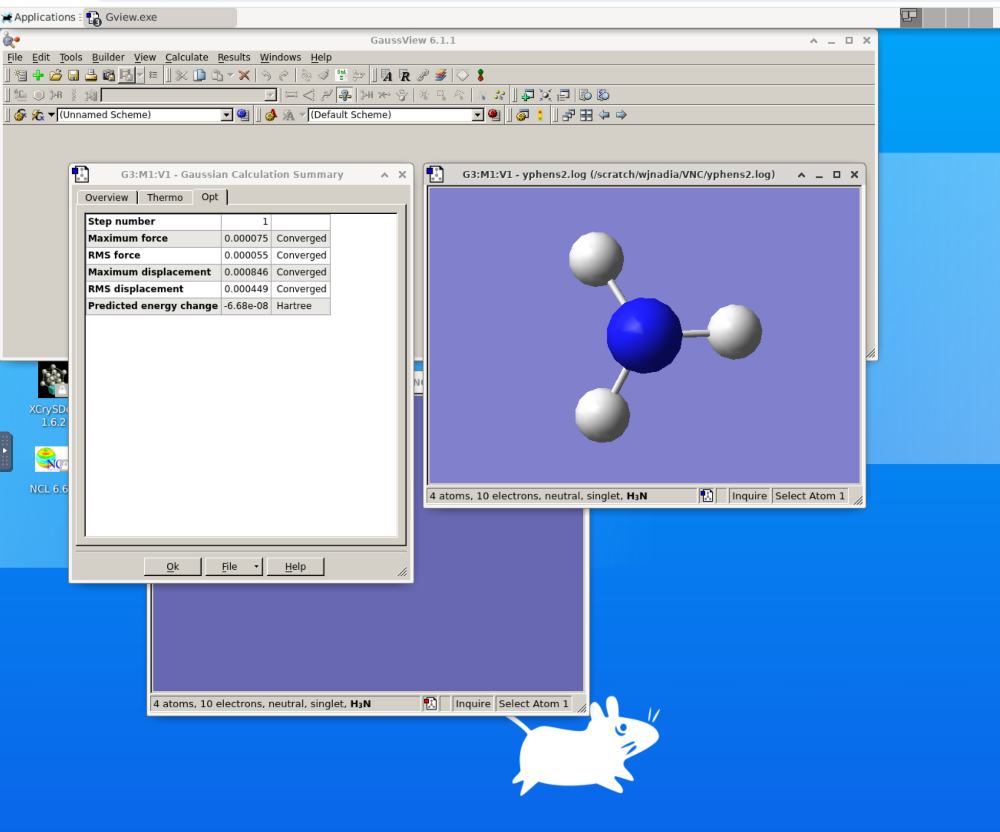

# 가우시안16(Gaussian16) on GPU

본 문서는 Neuron 시스템에서 가우시안 소프트웨어 사용을 위한 기초적인 정보를 제공하고 있습니다. 따라서, 가우시안 소프트웨어 사용법 및 Neuron/리눅스 사용법 등은 포함되어 있지 않습니다. Neuron/리눅스 사용법에 대한 정보는 KISTI 홈페이지(**https://www.ksc.re.kr**) 의 기술지원 > 사용자 지침서 등을 참고하시기 바랍니다.


## **가. 가우시안 소개**

가우시안은 에너지, 분자구조 및 진동주파수를 예측하는 분자 모델링 패키지이며, 화학, 물리, 생명과학, 공학 분야 연구자를 위한 프로그램입니다.

자세한 사항은 가우시안 사의 홈페이지를 통해 얻을 수 있습니다.

홈페이지 주소: http://gaussian.com


## **나. 설치 버전 및 라이선스**

* KISTI 슈퍼컴퓨팅센터는 가우시안 16 의 사이트 라이선스를 보유하고 있으며, Neuron 시스템에는 가우시안16 Rev. A03, B01, C01이 설치되어 있습니다.
* 가우시안16 Rev. A03 버전은 V100 GPU를 지원하지 않으며, K40 파티션으로 작업을 제출해야 하나, K40 파티션은 노드 구성 변경으로 퇴역되었으니 다른 버전을 사용하시기 바랍니다.
* 가우시안16를 사용하기 위해서는 사용자의 계정이 가우시안 그룹(gauss group)에 등록되어야 합니다. 가우시안 그룹 등록은 KISTI 홈페이지 또는 account@ksc.re.kr로 문의하시기 바랍니다.
* 내 계정이 가우시안 그룹에 속해있는지 확인하는 방법은 다음과 같습니다.

```shell-session
$ id 사용자ID
```

※ 가우시안 그룹에 포함되어 있으면 출력 결과에 "1000009(gauss)" 이 포함되어 있어야 합니다.

* 보안 문제로 사용자는 프로그램의 소스 코드에는 접근할 수 없고, 실행 파일과 기저함수(basis function)에만 접근할 수 있습니다. 실제로 프로그램을 사용하는 데는 아무런 지장이 없습니다.
* 가우시안에 연동하여 사용하는 프로그램을 사용하기 위해서는 사전에 일부 소스 코드 혹은 쉘 파일에 대한 접근권한이 필요하며 (예, Gaussrate) 이 경우 KISTI 홈페이지 또는 account@ksc.re.kr 메일을 통해 요청하셔야 합니다.
* HF 계산과 DFT 계산은 병렬로 수행할 수 있습니다.


## **다. 소프트웨어 실행 방법**

### **1. 환경설정**

가우시안16은 module 명령을 통하여 환경을 로드할 수 있습니다.

```shell-session
 $ module load gaussian/g16.c01
```

### **2. 스케쥴러 작업 스크립트 파일 작성**

Neuron 시스템에서는 로그인 노드에서 SLURM 이라는 스케쥴러를 사용하여 작업을 제출해야 합니다.

Neuron 시스템에서 SLURM을 사용하는 예제 파일들이 아래의 경로에 존재하므로 사용자 작업용 파일을 만들 때 이를 참고하시기 바랍니다.

* 독점 노드 방식으로 실행하는 예제 작업 스크립트 : /apps/applications/test\_samples/G16/g16.c01\_gpu.sh
* 공유 노드 방식으로 실행하는 예제 작업 스크립트 : /apps/applications/test\_samples/G16/g16.c01\_gpu\_share.sh

※ 아래 예제는 Neuron 시스템 에서의 가우시안16에 대한 예제입니다.

* 파일 위치: /apps/applications/test\_samples/G16/g16.c01\_gpu.sh

```bash
#!/bin/sh
#SBATCH -J test
#SBATCH -p cas_v100_4 #cas_v100_4 노드 사용
#SBATCH --nodes=1 
#SBATCH -o %x_%j.out # 표준 출력의 파일 이름을 정의
#SBATCH -e %x_%j.err # 표준 에러의 파일 이름을 정의
#SBATCH -t 00:30:00
#SBATCH --comment gaussian
#SBATCH --exclusive #노드를 독점으로 할당받아 사용
#SBATCH --gres=gpu:4

module purge
module load gaussian/g16.c01

export GAUSS_SCRDIR="$SLURM_SUBMIT_DIR"

export GAUSS_MDEF=96GB

export GAUSS_CDEF="0-39"
export GAUSS_GDEF="0-3=0,10,11,19"

g16 test.com
```

* GAUSS\_CDEF 변수는 %CPU 옵션과 동일하며, 입력파일에 %CPU 값이 있을 경우 해당 값이 적용 됩니다.
* 과거거 배타적 노드 정책에서는 한 노드드당 하나의 작업만이 독점적으로 할당되었기 때문에 특정 CPU를 지정하여 사용이 가능하였으나, 공유 노드 정책에서는 한 노드에 여러 작업이 수행될 수 있으며 작업에서 할당받은 CPU의 적절한 지정이 필요합니다. 위 예제에서는 cas\_v100\_4 노드를 독점적으로 할당받아 40 core와 4 GPU를 할당받아 작업 수행하는 예시입니다.
* 공유 노드에서의 작업 스크립트 예시는 /apps/applications/test\_samples/G16/g16.c01\_gpu\_share.sh 파일 참고 바랍니다.
* GAUSS\_GDEF 변수는 %GPUCPU 옵션과 동일하며, GPU 와 CPU 의 맵핑 옵션으로 0번 GPU(첫번째 GPU, nvidia-smi 명령으로 확인)의 제어 CPU를 0번 CPU로 지정함을 의미 합니다. (%GPUCPU=gpu-list=control-cpus)
* GAUSS\_MDEF 변수는 %Mem 옵션과 동일하며, 입력 파일에 %Mem 값이 있을 경우 해당 값이 적용 됩니다. 계산 규모에 따라 적절한 값을 입력해주시기 바라며, slurm 스케줄러에서 할당받은 메모리를 초과하지 않는 범위 내에서 설정하시기 바랍니다. (뉴론 사용자 지침서 > 스케줄러(SLURM)를 통한 작업 실행)
* 참고 : http://gaussian.com/relnotes

※ 가우시안 입력 파일을 PC에서 작성 후 FTP로 전송한다면, 반드시 ascii mode로 전송해야만 합니다.

* 기타 SLURM에 관련된 명령어 및 사용법은 Neuron 사용자 지침서를 참조하시면 됩니다.


* SLURM 스케쥴러의 주요 명령어 (세부 사항은 Neuron 시스템 사용자 지침서 참조)

| **명령어**            | **설명**                         |
| ------------------ | ------------------------------ |
| sbatch g16\_gpu.sh | SLURM에 작업스크립트(g16\_gpu.sh)를 제출 |
| squeue             | SLURM에 제출되어 대기/수행 중인 전체 작업 조회  |
| sinfo              | SLURM 파티션 정보 조회                |
| scancel job-id     | 작업 제출한 작업 취소                   |

### 3. GaussView 사용법

* GaussView는  GUI 기반 프로그램이기  때문에,  MyKSC(웹 서비스 포털)의 VNC(원격 데스크톱)에서  실행할 수 있습니다. ([**MyKSC VNC 사용법 참조**](https://docs-ksc.gitbook.io/myksc/app/vnc)**,** GPU 지원하지 않습니다.)&#x20;
* MyKSC VNC에서 GaussView는 할당된 계산 자원의 한계로 입력  데이터 생성 및 결과 분석 용도로  사용할 것을 권장하며,  본격적인 계산 작업은 배치 작업 스케줄러를 통해 실행해야 합니다.

<figure><figcaption><p>MyKSC VNC에서 GaussView 실행화면</p></figcaption></figure>

## **라. 참고자료**

* 가우시안을 처음으로 사용하고자 하는 사람은 다음의 책의 일독을 권합니다.
  * James B. Foresman and Aeleen Frisch, "Exploring Chemistry with Electronic Structure Methods: A Guide to Using Gaussian", www.amazon.com, www.bn.com 등의 온라인 서점에서 구매할 수 있고, http://gaussian.com에서도 직접 구매가 가능합니다.
* 가우시안에 관한 모든 정보는 Gaussian사의 홈페이지(http://gaussian.com)를 통해 얻을 수 있습니다.


2022년 11월 3일에 마지막으로 업데이트 되었습니다.

