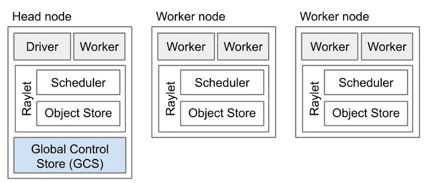
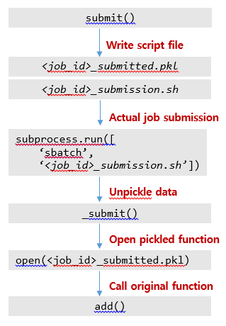
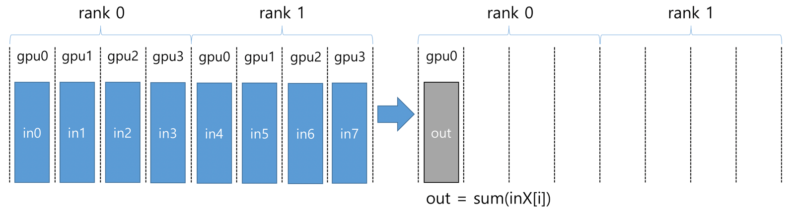

# AI 멀티노드 활용

뉴론 시스템에서 딥러닝 학습에 필요한 계산을 멀티 노드를 이용하여 수십 개의 GPU에 나누어 동시에 처리하고, 고속 네트워크를 통한 결과를 합산하는 분산 학습을 위한 여러 방법을 소개한다.


## 가. HOROVOD

Horovod는 고성능 분산 컴퓨팅 환경에서 노드간 메시지 전달 및 통신관리를 위해 일반적인 표준 MPI 모델을 사용하며, Horovod의 MPI구현은 표준 Tensorflow 분산 훈련 모델보다 간소화된 프로그래밍 모델을 제공한다.

### **1. HOROVOD (Tensorflow) 설치 및 확인**

#### 1) 설치 방법

```shell-session
$ module load gcc/10.2.0 cuda/11.4 cudampi/openmpi-4.1.1 python/3.7.1 cmake/3.16.9

$ conda create -n my_tensorflow
$ source activate my_tensorflow

(my_tensorflow) $ conda install tensorflow-gpu=2.0.0 tensorboard=2.0.0 tensorflow-estimator=2.0.0 python=3.7 cudnn cudatoolkit=10 nccl=2.8.3

(my_tensorflow) $ HOROVOD_WITH_MPI=1 HOROVOD_GPU_OPERATIONS=NCCL \
HOROVOD_NCCL_LINK=SHARED HOROVOD_WITH_TENSORFLOW=1 \
pip install --no-cache-dir horovod==0.23.0
```

#### 2) 설치 확인

```shell-session
(my_tensorflow) $ pip list | grep horovod 
horovod 0.23.0

(my_tensorflow) $ python 
>>> import horovod 
>>> horovod.__version__ '0.23.0‘ 

(my_tensorflow) $ horovodrun -cb
Horovod v0.23.0: 

 Available Frameworks: 
    [X] TensorFlow 
    [X] PyTorch 
    [ ] MXNet 

 Available Controllers: 
    [X] MPI 
    [X] Gloo 

 Available Tensor Operations: 
    [X] NCCL 
    [ ] DDL 
    [ ] CCL 
    [X] MPI 
    [X] Gloo
```

### **2. HOROVOD (Tensorflow) 실행 예제**

#### 1) 작업제출 스크립트를 이용한 실행

```bash
#!/bin/bash
#SBATCH -J test_job
#SBATCH -p cas_v100_4
#SBATCH -N 2
#SBATCH -n 4
#SBATCH -o %x.o%j
#SBATCH -e %x.e%j
#SBATCH --time 00:30:00
#SBATCH --gres=gpu:2
#SBATCH --comment tensorflow

module purge
module load gcc/10.2.0 cuda/11.4 cudampi/openmpi-4.1.1 python/3.7.1

source activate my_tensorflow

horovodrun -np 2 python tensorflow2_mnist.py
```

#### 2) 인터렉티브 작업제출을 이용한 실행

```shell-session
$ salloc --partition=cas_v100_4 -J debug --nodes=2 -n 4 --time=08:00:00 --gres=gpu:2 --comment=tensorflow

$ echo $SLURM_NODELIST
gpu[12-13]

$ module load gcc/10.2.0 cuda/11.4 cudampi/openmpi-4.1.1 python/3.7.1
$ source activate my_tensorflow

(my_tensorflow) $ horovodrun -np 4 -H gpu12:2,gpu13:2 python tensorflow2_mnist.py
```

### **3. HOROVOD (Pytorch) 설치 및 확인**

#### 1) 설치 방법

```shell-session
$ module load gcc/10.2.0 cuda/11.4 cudampi/openmpi-4.1.1 python/3.7.1 cmake/3.16.9

$ conda create -n my_pytorch
$ source activate my_pytorch

(my_pytorch) $ conda install pytorch=1.11.0 python=3.9 torchvision=0.12.0 torchaudio=0.11.0 cudatoolkit=10.2 -c pytorch
(my_pytorch) $ HOROVOD_WITH_MPI=1 HOROVOD_NCCL_LINK=SHARED HOROVOD_GPU_OPERATIONS=NCCL HOROVOD_WITH_PYTORCH=1 \
pip install --no-cache-dir horovod==0.24.0
```

#### 2) 설치 확인

```shell-session
(my_pytorch) $ pip list | grep horovod
horovod 0.24.0

(my_pytorch) $ python
>>> import horovod
>>> horovod.__version__
'0.24.0'

(my_pytorch) $ horovodrun -cb
Horovod v0.24.0:

Available Frameworks:
    [ ] TensorFlow
    [X] PyTorch
    [ ] MXNet


Available Controllers:
    [X] MPI
    [X] Gloo

Available Tensor Operations:
    [X] NCCL
    [ ] DDL
    [ ] CCL
    [X] MPI
    [X] Gloo
```

### **4. HOROVOD (Pytorch) 실행 예제**

#### 1) 작업제출 스크립트 예제

```bash
#!/bin/bash
#SBATCH -J test_job
#SBATCH -p cas_v100_4
#SBATCH -N 2
#SBATCH -n 4
#SBATCH -o %x.o%j
#SBATCH -e %x.e%j
#SBATCH --time 00:30:00
#SBATCH --gres=gpu:2
#SBATCH --comment pytorch

module purge
module load gcc/10.2.0 cuda/11.4 cudampi/openmpi-4.1.1 python/3.7.1

source activate my_pytorch

horovodrun -np 2 python pytorch_ex.py
```

#### 2) 인터렉티브 작업제출을 이용한 실행

```shell-session
$ salloc --partition=cas_v100_4 -J debug --nodes=2 -n 4 --time=08:00:00 --gres=gpu:2 --comment=pytorch

$ echo $SLURM_NODELIST gpu[22-23] 

$ module load gcc/10.2.0 cuda/11.4 cudampi/openmpi-4.1.1 python/3.7.1 
$ source activate my_pytorch 

(my_pytorch) $ horovodrun -np 4 -H gpu22:2,gpu23:2 python pytorch_ex.py
```

## 나. GLOO

* GLOO는 Facebook 에서 개발한 오픈 소스 집단 커뮤니케이션 라이브러리로, horovod 에 포함되어 있으며 사용자가 MPI 를 설치하지 않고도 horovod 를 이용한 멀티노드 작업 수행을 지원한다.
* GLOO의 설치는 horovod에 종속성을 가지며, horovod를 설치하는 과정에서 같이 설치된다.

※ horovod 의 설치방법은 상단의 horovod 설치 및 확인을 참고

### **1. GLOO 실행 예제**

#### 1) 작업제출 스크립트 예제

```bash
#!/bin/bash
#SBATCH -J test_job
#SBATCH -p cas_v100_4
#SBATCH -N 2
#SBATCH -n 4
#SBATCH -o %x.o%j
#SBATCH -e %x.e%j
#SBATCH --time 00:30:00
#SBATCH --gres=gpu:2
#SBATCH --comment tensorflow

module purge
module load gcc/10.2.0 cuda/11.4 cudampi/openmpi-4.1.1 python/3.7.1
source activate my_tensorflow

horovodrun --gloo -np 4 python tensorflow2_mnist.py
```

#### 2) 인터렉티브 작업제출을 이용한 실행

```shell-session
$ salloc --partition=cas_v100_4 -J debug --nodes=2 -n 4 --time=08:00:00 --gres=gpu:2 --comment=tensorflow

$ echo $SLURM_NODELIST
  gpu[12-13]

$ module load gcc/10.2.0 cuda/11.4 cudampi/openmpi-4.1.1 python/3.7.1
$ source activate my_tensorflow

(my_tensorflow) $ horovodrun –np 4 --gloo --network-interface ib0 -H gpu12:2,gpu13:2 python tensorflow2_mnist.py
```


## 다. Ray

Ray는 멀티노드 환경에서 병렬 실행을 위한 python 기반의 워크로드를 제공한다. 다양한 라이브러리를 사용하여 pytorch와 같은 딥러닝 모델에서 사용할 수 있다. 자세한 내용은 다음 홈페이지에서 확인할 수 있다.

<mark style="color:blue;">**https://docs.ray.io/en/latest/cluster/index.html**</mark>

### **1. Ray 설치 및 단일 노드 실행 예제**

#### 1) 설치 방법

```shell-session
$ module load gcc/10.2.0 cuda/11.4 cudampi/openmpi-4.1.1 python/3.7.1
$ conda create -n my_ray
$ source activate my_ray

(my_ray) $ pip install --no-cache-dir ray

$ export PATH=/home01/${USER}/.local/bin:$PATH
```

#### 2) 작업제출 스크립트 예제

```bash
#!/bin/bash
#SBATCH -J test_job
#SBATCH -p cas_v100_4
#SBATCH -N 1
#SBATCH -n 4
#SBATCH -o %x.o%j
#SBATCH -e %x.e%j
#SBATCH --time 00:30:00
#SBATCH --gres=gpu:2
#SBATCH --comment xxx

module purge
module load gcc/10.2.0 cuda/11.4 cudampi/openmpi-4.1.1 python/3.7.1
source activate my_ray

python test.py
```


```python
import ray 

ray.init() 

@ray.remote 
def f(x):
     return x * x 

 futures = [f.remote(i) for i in range(4)] 

 print(ray.get(futures)) # [0, 1, 4, 9] 

 @ray.remote
 class Counter(object): 
     def __init__(self): 
        self.n = 0 

     def increment(self): 
        self.n += 1 

     def read(self): 
        return self.n 

counters = [Counter.remote() for i in range(4)] 
[c.increment.remote() for c in counters] 
futures = [c.read.remote() for c in counters] 
print(ray.get(futures)) # [1, 1, 1, 1]
```


#### 3) 인터렉티브 작업제출을 이용한 실행

```shell-session
$ salloc --partition=cas_v100_4 -J debug --nodes=1 -n 4 --time=08:00:00 --gres=gpu:2 --comment=xxx
$ module load gcc/10.2.0 cuda/11.4 cudampi/openmpi-4.1.1 python/3.7.1

$ source activate my_ray

(my_tensorflow) $ python test.py
[0, 1, 4, 9]
[1, 1, 1, 1]
```


### **2. Ray Cluster 설치 및 멀티 노드 실행 예제**

Ray는 멀티노드 실행 시 하나의 head 노드와 다수의 worker 노드로 실행되며, 테스크를 할당된 자원에 효율적으로 스케줄링 해 준다.



NERSC에서 작성한 예제는 GITHUB(https://github.com/NERSC/slurm-ray-cluster.git)를 통해 다운로드 할 수 있고, 다음과 같이 실행할 수 있다.

#### 1) 설치 방법

```shell-session
$ git clone https://github.com/NERSC/slurm-ray-cluster.git
$ cd slurm-ray-cluster

[edit submit-ray-cluster.sbatch, start-head.sh, start-worker.sh]

$ sbatch submit-ray-cluster.sbatch
```

#### 2) 작업제출 스크립트 예제

```bash
#!/bin/bash

#SBATCH -J ray_test
#SBATCH -p cas_v100_4
#SBATCH --time=00:10:00

### This script works for any number of nodes, Ray will find and manage all resources
#SBATCH --nodes=2

### Give all resources to a single Ray task, ray can manage the resources internally
#SBATCH --ntasks-per-node=4
#SBATCH --comment etc
#SBATCH --gres=gpu:2

# Load modules or your own conda environment here
module load gcc/8.3.0 cuda/10.0 cudampi/openmpi-3.1.0 python/3.7.1
source activate my_ray
export PATH=/home01/${USER} /.local/bin:$PATH


…

#### call your code below
python test.py
exit 
```


```bash
#!/bin/bash 

#export LC_ALL=C.UTF-8 
#export LANG=C.UTF-8 

echo "starting ray head node" 
# Launch the head node 
ray start --head --node-ip-address=$1 --port=12345 --redis-password=$2 
sleep infinity
```



```bash
#!/bin/bash 

#export LC_ALL=C.UTF-8 
#export LANG=C.UTF-8 

echo "starting ray worker node" 
ray start --address $1 --redis-password=$2 
sleep infinity
```


#### 3) output

```
==========================================
SLURM_JOB_ID = 107575
SLURM_NODELIST = gpu[21-22]
==========================================
         'cuda/10.0' supports the {CUDA_MPI}. 
IP Head: 10.151.0.21:12345
STARTING HEAD at gpu21
starting ray head node
2022-04-27 10:57:38,976 INFO services.py:1092 -- View the Ray dashboard at http://localhost:8265
2022-04-27 10:57:38,599 INFO scripts.py:467 -- Local node IP: 10.151.0.21
2022-04-27 10:57:39,000 SUCC scripts.py:497 -- --------------------
2022-04-27 10:57:39,000 SUCC scripts.py:498 -- Ray runtime started.
2022-04-27 10:57:39,000 SUCC scripts.py:499 -- --------------------
2022-04-27 10:57:39,000 INFO scripts.py:501 -- Next steps
2022-04-27 10:57:39,000 INFO scripts.py:503 -- To connect to this Ray runtime from another node, run
2022-04-27 10:57:39,000 INFO scripts.py:507 -- ray start --address='10.151.0.21:12345' --redis-password='90268c54-9df9-4d98-b363-ed6ed4d61a61'
2022-04-27 10:57:39,000 INFO scripts.py:509 -- Alternatively, use the following Python code:
2022-04-27 10:57:39,001 INFO scripts.py:512 -- import ray
2022-04-27 10:57:39,001 INFO scripts.py:519 -- ray.init(address='auto', _redis_password='90268c54-9df9-4d98-b363-ed6ed4d61a61')
2022-04-27 10:57:39,001 INFO scripts.py:522 -- If connection fails, check your firewall settings and network configuration.
2022-04-27 10:57:39,001 INFO scripts.py:526 -- To terminate the Ray runtime, run
2022-04-27 10:57:39,001 INFO scripts.py:527 -- ray stop
STARTING WORKER 1 at gpu22
starting ray worker node
2022-04-27 10:58:08,922 INFO scripts.py:591 -- Local node IP: 10.151.0.22
2022-04-27 10:58:09,069 SUCC scripts.py:606 -- --------------------
2022-04-27 10:58:09,069 SUCC scripts.py:607 -- Ray runtime started.
2022-04-27 10:58:09,069 SUCC scripts.py:608 -- --------------------
2022-04-27 10:58:09,069 INFO scripts.py:610 -- To terminate the Ray runtime, run
2022-04-27 10:58:09,069 INFO scripts.py:611 -- ray stop
2022-04-27 10:58:13,915 INFO services.py:1092 -- View the Ray dashboard at http://127.0.0.1:8265
[0, 1, 4, 9]
[1, 1, 1, 1]
```

### **3. Ray Cluster (pytorch) 설치 및 멀티 노드 실행 예제**

#### 1) 설치 방법

```shell-session
$ pip install --user torch torchvision torchaudio tabulate tensorboardX

[edit submit-ray-cluster.sbatch]

$ sbatch submit-ray-cluster.sbatch
```

#### 2) 작업제출 스크립트 예제

```bash
#!/bin/bash

#SBATCH -J ray_test
#SBATCH -p cas_v100_4
#SBATCH --time=00:10:00

### This script works for any number of nodes, Ray will find and manage all resources
#SBATCH --nodes=2

### Give all resources to a single Ray task, ray can manage the resources internally
#SBATCH --ntasks-per-node=4
#SBATCH --comment etc
#SBATCH --gres=gpu:2

# Load modules or your own conda environment here
module load gcc/8.3.0 cuda/10.0 cudampi/openmpi-3.1.0 python/3.7.1
source activate my_ray
export PATH=/home01/${USER} /.local/bin:$PATH

…

#### call your code below
python examples/mnist_pytorch_trainable.py
exit
```


```python
from __future__ import print_function

import argparse
import os
import torch
import torch.optim as optim

import ray
from ray import tune
from ray.tune.schedulers import ASHAScheduler
from ray.tune.examples.mnist_pytorch import (train, test, get_data_loaders,
                                             ConvNet)

...

 ray.init(address='auto', _node_ip_address=os.environ["ip_head"].split(":")[0], _redis_password=os.environ["redis_password"])
      sched = ASHAScheduler(metric="mean_accuracy", mode="max")
      analysis = tune.run(TrainMNIST,
                         scheduler=sched,
                         stop={"mean_accuracy": 0.99,
                               "training_iteration": 100},
                         resources_per_trial={"cpu":10, "gpu": 1},
                         num_samples=128,
                         checkpoint_at_end=True,
                         config={"lr": tune.uniform(0.001, 1.0),
                                 "momentum": tune.uniform(0.1, 0.9),
                                 "use_gpu": True})
 print("Best config is:", analysis.get_best_config(metric="mean_accuracy", mode="max"))
```


#### 3) output

```
...

== Status == 
Memory usage on this node: 57.4/377.4 GiB 
Using AsyncHyperBand: num_stopped=11 
Bracket: Iter 64.000: None | Iter 16.000: 0.9390625000000001 | Iter 4.000: 0.85625 | Iter 1.000: 0.534375 
Resources requested: 80/80 CPUs, 8/8 GPUs, 0.0/454.88 GiB heap, 0.0/137.26 GiB objects 
Result logdir: /home01/${USER}/ray_results/TrainMNIST_2022-04-27_11-24-20 
Number of trials: 20/128 (1 PENDING, 8 RUNNING, 11 TERMINATED) 
+------------------------+------------+------------------+-----------+------------+----------+--------+------------------+ 
| Trial name             | status     | loc              |        lr |   momentum |      acc |   iter |   total time (s) | 
|------------------------+------------+------------------+-----------+------------+----------+--------+------------------| 
| TrainMNIST_25518_00000 | RUNNING    | 10.151.0.22:4128 | 0.0831396 |   0.691582 | 0.953125 |     26 |         4.98667  | 
| TrainMNIST_25518_00001 | RUNNING    | 10.151.0.22:4127 | 0.0581841 |   0.685648 | 0.94375  |     25 |         5.08798  | 
| TrainMNIST_25518_00013 | RUNNING    |                  | 0.0114732 |   0.386122 |          |        |                  | 
| TrainMNIST_25518_00014 | RUNNING    |                  | 0.686305  |   0.546706 |          |        |                  | 
| TrainMNIST_25518_00015 | RUNNING    |                  | 0.442195  |   0.525069 |          |        |                  | 
| TrainMNIST_25518_00016 | RUNNING    |                  | 0.647866  |   0.397167 |          |        |                  | 
| TrainMNIST_25518_00017 | RUNNING    |                  | 0.479493  |   0.429876 |          |        |                  | 
| TrainMNIST_25518_00018 | RUNNING    |                  | 0.341561  |   0.42485  |          |        |                  | 
| TrainMNIST_25518_00019 | PENDING    |                  | 0.205629  |   0.551851 |          |        |                  | 
| TrainMNIST_25518_00002 | TERMINATED |                  | 0.740295  |   0.209155 | 0.078125 |      1 |         0.206633 | 
| TrainMNIST_25518_00003 | TERMINATED |                  | 0.202496  |   0.102844 | 0.853125 |      4 |         1.17559  | 
| TrainMNIST_25518_00004 | TERMINATED |                  | 0.431773  |   0.449912 | 0.85625  |      4 |         0.811173 | 
| TrainMNIST_25518_00005 | TERMINATED |                  | 0.595764  |   0.643525 | 0.121875 |      1 |         0.214556 | 
| TrainMNIST_25518_00006 | TERMINATED |                  | 0.480667  |   0.412854 | 0.728125 |      4 |         0.885571 | 
| TrainMNIST_25518_00007 | TERMINATED |                  | 0.544958  |   0.280743 | 0.15625  |      1 |         0.185517 | 
| TrainMNIST_25518_00008 | TERMINATED |                  | 0.277231  |   0.258283 | 0.48125  |      1 |         0.186344 | 
| TrainMNIST_25518_00009 | TERMINATED |                  | 0.87852   |   0.28864  | 0.10625  |      1 |         0.203304 | 
| TrainMNIST_25518_00010 | TERMINATED |                  | 0.691046  |   0.351471 | 0.103125 |      1 |         0.23274  | 
| TrainMNIST_25518_00011 | TERMINATED |                  | 0.926629  |   0.17118  | 0.121875 |      1 |         0.267205 | 
| TrainMNIST_25518_00012 | TERMINATED |                  | 0.618234  |   0.881444 | 0.046875 |      1 |         0.226228 | 
+------------------------+------------+------------------+-----------+------------+----------+--------+------------------+
...
```

## 라. Submit it

Submitit은 Slurm 클러스터 내에서 계산을 위해 Python 함수를 제출하기 위한 경량 도구이다. 기본적으로 스케줄러에 제출된 내용을 정리하여 결과, 로그 등에 대한 액세스를 제공한다.

### **1. 예제 (1)**


```python
#!/usr/bin/env python3 

 import submitit 

 def add(a, b): 
    return a + b 

 # create slurm wrapper object 
executor = submitit.AutoExecutor(folder="log_test") 

 # update slurm parameters 
executor.update_parameters( 
    partition=‘cas_V100_2’, 
    comment=‘python’ ) 

 # submit job 
job = executor.submit(add, 5, 7) 

 # print job ID 
print(job.job_id) 

 # print result 
print(job.result())
```


```shell-session
$ ./add.py 
110651 
12
```


```bash
#!/bin/bash 

# Parameters
#SBATCH --comment="python"
#SBATCH --error=/scratch/${USER}/2022/02-submitit/test/log_test/%j_0_log.err
#SBATCH --job-name=submitit
#SBATCH --nodes=1
#SBATCH --ntasks-per-node=1
#SBATCH --open-mode=append
#SBATCH --output=/scratch/${USER}/2022/02-submitit/test/log_test/%j_0_log.out
#SBATCH --partition=cas_v100_2
#SBATCH --signal=USR1@90
#SBATCH --wckey=submitit

# command
export SUBMITIT_EXECUTOR=slurm
srun 
    --output /scratch/${USER}/2022/02-submitit/test/log_test/%j_%t_log.out 
    --error /scratch/${USER}/2022/02-submitit/test/log_test/%j_%t_log.err 
    --unbuffered 
    /scratch/${USER}/.conda/submitit/bin/python3 
    -u 
    -m submitit.core._submit 
    /scratch/${USER}/2022/02-submitit/test/log_test
```


* Python function stored as pickle file

```shell-session
-rw-r--r-- 1 testuser01 tu0000   0 May  4 21:28 log_test/110651_0_log.err
-rw-r--r-- 1 testuser01 tu0000 476 May  4 21:28 log_test/110651_0_log.out
-rw-r--r-- 1 testuser01 tu0000  26 May  4 21:28 log_test/110651_0_result.pkl
-rw-r--r-- 1 testuser01 tu0000 634 May  4 21:28 log_test/110651_submitted.pkl
-rw-r--r-- 1 testuser01 tu0000 735 May  4 21:28 log_test/110651_submission.sh
```

### **2. 예제 (2)**


```python
#!/usr/bin/env python3 

 def add(a, b): 
    return a + b 

 print(add(5, 7)) 
```



```bash
#!/bin/bash
 
#SBATCH --comment="python" 
#SBATCH --job-name=submitit 
#SBATCH --nodes=1 
#SBATCH --ntasks-per-node=1 
#SBATCH --partition=cas_v100_2 

./add.py
```


```shell-session
$ sbatch run.sh 
110650
```


```python
#!/usr/bin/env python3 

 import submitit 

 def add(a, b): 
    return a + b 

 # create slurm wrapper object 
executor = submitit.AutoExecutor(folder="log_test") 

 # update slurm parameters 
executor.update_parameters( 
    partition=‘cas_V100_2’, 
    comment=‘python’ 
) 

 # submit job 
job = executor.submit(add, 5, 7) 

 # print job ID 
print(job.job_id) 

 # print result 
print(job.result())
```


```shell-session
$ ./add.py 
110651 
12
```



### **3. Submit: Multitask Job 예제**


```python
#!/usr/bin/env python3 

 import submitit 

 def add(a, b): 
    return a + b 

 # create slurm object 
executor = submitit.AutoExecutor(folder="log_test") 

 # slurm parameters 
executor.update_parameters( 
    partition=‘cas_V100_2’, 
    comment=‘python’, 
    ntasks_per_node=3) 
) 

 # submit job 
job = executor.submit(add, 5, 7) 

 # print job ID 
print(job.job_id) 

 # print results 
print(job.results())
```


```shell-session
$ ./add_para.py 
110658 
[12, 12, 12]
```


```python
def _make_sbatch_string( 
    command: str, 
    folder: tp.Union[str, Path], 
    job_name: str = "submitit", 
    partition: tp.Optional[str] = None, 
    time: int = 5, 
    nodes: int = 1, 
    ntasks_per_node: tp.Optional[int] = None, 
    cpus_per_task: tp.Optional[int] = None, 
    cpus_per_gpu: tp.Optional[int] = None, 
    num_gpus: tp.Optional[int] = None,  # legacy 
    gpus_per_node: tp.Optional[int] = None, 
    gpus_per_task: tp.Optional[int] = None, 
    qos: tp.Optional[str] = None,  # quality of service 
    setup: tp.Optional[tp.List[str]] = None, 
    mem: tp.Optional[str] = None, 
    mem_per_gpu: tp.Optional[str] = None, 
    mem_per_cpu: tp.Optional[str] = None, 
    signal_delay_s: int = 90, 
    comment: tp.Optional[str] = None, 
    constraint: tp.Optional[str] = None, 
    exclude: tp.Optional[str] = None, 
    account: tp.Optional[str] = None, 
    gres: tp.Optional[str] = None, 
    exclusive: tp.Optional[tp.Union[bool, str]] = None, 
    array_parallelism: int = 256, 
    wckey: str = "submitit", 
    stderr_to_stdout: bool = False, 
    map_count: tp.Optional[int] = None,  # used internally 
    additional_parameters: tp.Optional[tp.Dict[str, tp.Any]] = None, 
    srun_args: tp.Optional[tp.Iterable[str]] = None ) -> str:
```


```shell-session
 - 110658_0_log.out 
submitit INFO (2022-04-08 12:32:19,583) 
- Starting with JobEnvironment(job_id=110658, hostname=gpu25, local_rank=0(3), node=0(1), 
global_rank=0(3)) submitit INFO (2022-04-08 12:32:19,584) 
- Loading pickle: /scratch/${USER}/2022/02-submitit/test/log_test/110658_submitted.pkl 
submitit INFO (2022-04-08 12:32:19,612) - Job completed successfully 

 - 110658_1_log.out submitit 
INFO (2022-04-08 12:32:19,584) 
- Starting with JobEnvironment(job_id=110658, hostname=gpu25, local_rank=1(3), node=0(1), global_rank=1(3)) 
submitit INFO (2022-04-08 12:32:19,620) 
- Loading pickle: /scratch/${USER}/2022/02-submitit/test/log_test/110658_submitted.pkl 
submitit INFO (2022-04-08 12:32:19,624) - Job completed successfully 

 - 110658_2_log.out 
submitit INFO (2022-04-08 12:32:19,583) 
- Starting with JobEnvironment(job_id=110658, hostname=gpu25, local_rank=2(3), node=0(1), global_rank=2(3)) 
submitit INFO (2022-04-08 12:32:19,676) 
- Loading pickle: /scratch/${USER}/2022/02-submitit/test/log_test/110658_submitted.pkl 
submitit INFO (2022-04-08 12:32:19,681) - Job completed successfully
```

```python
import torch 
import torch.multiprocessing as mp 
import torchvision 

 class NeuralNet(self): 
    def __init__(self):

        self.layer1 = … 
        self.layer2 = … 


#Allow passing an NN object to submit()
      def __call__(self):
         job_env = submitit.JobEnvironment() # local rank, global rank 
        dataset = torchvision.dataset.MNIST(…) 
        loader  =  torch.utils.data.DataLoader(…) 

        mp.spawn(…) # data distributed training

mnist = NeuralNet() … job = executor.submit(mnist)
...
job = executor.submit(mnist)
```

## 마. NCCL

뉴론 시스템에서 NVIDIA GPU에 최적화된 다중 GPU 및 다중 노드 집단 통신 라이브러리인 NCCL의 설치방법 및 예제 실행 방법을 소개한다.

### **1. NCCL설치 및 확인**

#### 1) 설치 방법

https://developer.nvidia.com/nccl/nccl-legacy-downloads에서 설치를 원하는 버전 다운로드

```shell-session
$ tar Jxvf nccl_2.11.4-1+cuda11.4_x86_64.txz
```

#### 2) 설치 확인

```shell-session
$ ls –al nccl_2.11.4-1+cuda11.4_x86_64/
include/  lib/    LICENSE.txt
```

### **2. NCCL실행 예제**

#### 1) 실행 예제 다운로드

```shell-session
$ git clone https://github.com/1duo/nccl-examples
```

#### 2) 실행 예제 컴파일

```shell-session
$ module load gcc/10.2.0 cuda/11.4 cudampi/openmpi-4.1.1

$ cd nccl-example​
$ mkdir build
$ cd build
$ cmake -DNCCL_INCLUDE_DIR=$NCCL_HOME/include
                -DNCCL_LIBRARY=$NCCL_HOME/lib/libnccl.so ..
$ make
```

#### 3) 실행 결과 확인

```shell-session
$ ./run.sh
Example 1: Single Process, Single Thread, Multiple Devices
Success
Example 2: One Device Per Process Or Thread
[MPI Rank 1] Success
[MPI Rank 0] Success
Example 3: Multiple Devices Per Thread
[MPI Rank 1] Success
[MPI Rank 0] Success
```

#### 4) 위의 Example 3을 이용한 2노드 8GPU 실행 예제

#### 4-1) 작업스크립트

```bash
#!/bin/sh
#SBATCH -J STREAM
#SBATCH --time=10:00:00 # walltime
#SBATCH --nodes=2
#SBATCH --ntasks-per-node=1
#SBATCH --cpus-per-task=1
#SBATCH --gres=gpu:4
#SBATCH -o %N_%j.out
#SBATCH -e %N_%j.err
#SBATCH -p amd_a100_4

srun build/examples/example-3
```

#### 4-2) 예제 코드

```c
//
// Example 3: Multiple Devices Per Thread
//

#include
#include "cuda_runtime.h"
#include "nccl.h"
#include "mpi.h"
#include
#include
#include

#define MPICHECK(cmd) do {                          \
  int e = cmd;                                      \
  if( e != MPI_SUCCESS ) {                          \
    printf("Failed: MPI error %s:%d '%d'\n",        \
        __FILE__,__LINE__, e);                      \
    exit(EXIT_FAILURE);                             \
  }                                                 \
} while(0)

#define CUDACHECK(cmd) do {                         \
  cudaError_t e = cmd;                              \
  if( e != cudaSuccess ) {                          \
    printf("Failed: Cuda error %s:%d '%s'\n",       \
        __FILE__,__LINE__,cudaGetErrorString(e));   \
    exit(EXIT_FAILURE);                             \
  }                                                 \
} while(0)


#define NCCLCHECK(cmd) do {                         \
  ncclResult_t r = cmd;                             \
  if (r!= ncclSuccess) {                            \
    printf("Failed, NCCL error %s:%d '%s'\n",       \
        __FILE__,__LINE__,ncclGetErrorString(r));   \
    exit(EXIT_FAILURE);                             \
  }                                                 \
} while(0)

static uint64_t getHostHash(const char *string) {
    // Based on DJB2, result = result * 33 + char
    uint64_t result = 5381;
    for (int c = 0; string[c] != '\0'; c++) {
        result = ((result << 5) + result) + string[c];
    }
    return result;
}

static void getHostName(char *hostname, int maxlen) {
    gethostname(hostname, maxlen);
    for (int i = 0; i < maxlen; i++) {
        if (hostname[i] == '.') {
            hostname[i] = '\0';
            return;
        }
    }
}

int main(int argc, char *argv[]) {
    //int size = 32 * 1024 * 1024;
    int size = 5;
    int myRank, nRanks, localRank = 0;

    // initializing MPI
    MPICHECK(MPI_Init(&argc, &argv));
    MPICHECK(MPI_Comm_rank(MPI_COMM_WORLD, &myRank));
    MPICHECK(MPI_Comm_size(MPI_COMM_WORLD, &nRanks));

    // calculating localRank which is used in selecting a GPU
    uint64_t hostHashs[nRanks];
    char hostname[1024];
    getHostName(hostname, 1024);
    hostHashs[myRank] = getHostHash(hostname);
    MPICHECK(MPI_Allgather(MPI_IN_PLACE, 0, MPI_DATATYPE_NULL,
                           hostHashs, sizeof(uint64_t), MPI_BYTE, MPI_COMM_WORLD));

    for (int p = 0; p < nRanks; p++) {
        if (p == myRank) {
            break;
        }

        if (hostHashs[p] == hostHashs[myRank]) {
            localRank++;
        }
    }

    // each process is using four GPUs
    int nDev = 4;
    int **hostsendbuff = (int **) malloc(nDev * sizeof(int *));
    int **hostrecvbuff = (int **) malloc(nDev * sizeof(int *));
    int **sendbuff = (int **) malloc(nDev * sizeof(int *));
    int **recvbuff = (int **) malloc(nDev * sizeof(int *));

    cudaStream_t *s = (cudaStream_t *) malloc(sizeof(cudaStream_t) * nDev);

    // picking GPUs based on localRank
    for (int i = 0; i < nDev; ++i) {
                    hostsendbuff[i] = (int *) malloc(size * sizeof(int));
               for (int j = 0; j < size; j++) {
                    hostsendbuff[i][j]=1;
                }
                    hostrecvbuff[i] = (int *) malloc(size * sizeof(int));

        CUDACHECK(cudaSetDevice(localRank * nDev + i));
        CUDACHECK(cudaMalloc(sendbuff + i, size * sizeof(int)));
        CUDACHECK(cudaMalloc(recvbuff + i, size * sizeof(int)));
        CUDACHECK(cudaMemcpy(sendbuff[i], hostsendbuff[i], size * sizeof(int),
                              cudaMemcpyHostToDevice));
        CUDACHECK(cudaMemset(recvbuff[i], 0, size * sizeof(int)));
        CUDACHECK(cudaStreamCreate(s + i));
    }

    ncclUniqueId id;
    ncclComm_t comms[nDev];

    // generating NCCL unique ID at one process and broadcasting it to all
    if (myRank == 0) {
        ncclGetUniqueId(&id);
    }

    MPICHECK(MPI_Bcast((void *) &id, sizeof(id), MPI_BYTE, 0,
                       MPI_COMM_WORLD));
    // initializing NCCL, group API is required around ncclCommInitRank
    // as it is called across multiple GPUs in each thread/process
    NCCLCHECK(ncclGroupStart());
    for (int i = 0; i < nDev; i++) {
        CUDACHECK(cudaSetDevice(localRank * nDev + i));
        NCCLCHECK(ncclCommInitRank(comms + i, nRanks * nDev, id,
                                   myRank * nDev + i));
    }
    NCCLCHECK(ncclGroupEnd());

    // calling NCCL communication API. Group API is required when
    // using multiple devices per thread/process
    NCCLCHECK(ncclGroupStart());
    for (int i = 0; i < nDev; i++) {
NCCLCHECK(ncclAllReduce((const void *) sendbuff[i],
                             (void *) recvbuff[i], size, ncclInt, ncclSum,
                             comms[i], s[i]));
    }
    NCCLCHECK(ncclGroupEnd());

    // synchronizing on CUDA stream to complete NCCL communication
    for (int i = 0; i < nDev; i++) {
        CUDACHECK(cudaStreamSynchronize(s[i]));
    }

    // freeing device memory
    for (int i = 0; i < nDev; i++) {
        CUDACHECK(cudaMemcpy(hostrecvbuff[i], recvbuff[i], size * sizeof(int),
                             cudaMemcpyDeviceToHost));
        CUDACHECK(cudaFree(sendbuff[i]));
        CUDACHECK(cudaFree(recvbuff[i]));

    }

    printf(" \n");
    for (int i = 0; i < nDev; i++) {
        printf("%s rank:%d gpu%d ", hostname, myRank, i);
        for (int j = 0; j < size; j++) {
                printf("%d ", hostsendbuff[i][j]);
        }
        printf("\n");
    }

    printf(" \n");
    for (int i = 0; i < nDev; i++) {
        printf("%s rank:%d gpu%d ", hostname, myRank, i);
        for (int j = 0; j < size; j++) {
                printf("%d ", hostrecvbuff[i][j]);
        }
        printf("\n");
    }

    // finalizing NCCL

    for (int i = 0; i < nDev; i++) {
        ncclCommDestroy(comms[i]);
    }

    // finalizing MPI
    MPICHECK(MPI_Finalize());
    printf("[MPI Rank %d] Success \n", myRank);
    return 0;
}
```

#### 4-3) 실행 결과

```shell-session
gpu37 rank:1 gpu0 1 1 1 1 1 1 1 1
gpu37 rank:1 gpu1 2 2 2 2 2 2 2 2
gpu37 rank:1 gpu2 3 3 3 3 3 3 3 3
gpu37 rank:1 gpu3 4 4 4 4 4 4 4 4

gpu37 rank:1 gpu0 0 0 0 0 0 0 0 0
gpu37 rank:1 gpu1 0 0 0 0 0 0 0 0
gpu37 rank:1 gpu2 0 0 0 0 0 0 0 0
gpu37 rank:1 gpu3 0 0 0 0 0 0 0 0
[MPI Rank 1] Success

gpu36 rank:0 gpu0 1 1 1 1 1 1 1 1
gpu36 rank:0 gpu1 2 2 2 2 2 2 2 2
gpu36 rank:0 gpu2 3 3 3 3 3 3 3 3
gpu36 rank:0 gpu3 4 4 4 4 4 4 4 4

gpu36 rank:0 gpu0 20 20 20 20 20 20 20 20
gpu36 rank:0 gpu1 0 0 0 0 0 0 0 0
gpu36 rank:0 gpu2 0 0 0 0 0 0 0 0
gpu36 rank:0 gpu3 0 0 0 0 0 0 0 0

[MPI Rank 0] Success
```



## **바. Tensorflow Distribute**

Tensorflow Distibute는 멀티 GPU 또는 멀티 서버를 활용하여 분산 훈련을 할 수 있는 Tensorflow API 이다(Tensorflow 2.0 사용).

### **1. Conda 환경에서 tensorflow 설치 및 확인**

#### 1) 설치 방법

```shell-session
$ module load python/3.7.1
$ conda create -n tf_test
$ conda activate tf_test
(tf_test) $ conda install tensorflow
```


#### 2) 설치 확인

```shell-session
(tf_test) $ conda list | grep tensorflow
tensorflow                2.0.0           gpu_py37h768510d_0
tensorflow-base           2.0.0           gpu_py37h0ec5d1f_0
tensorflow-estimator      2.0.0              pyh2649769_0
tensorflow-gpu            2.0.0                h0d30ee6_0
tensorflow-metadata       1.7.0                    pypi_0    pypi
```

### **2. 단일 노드, 멀티 GPU 활용(tf.distribute.MirroredStrategy() 사용)**

#### 1) 코드 예제(tf\_multi\_keras.py)

```python
import tensorflow as tf 
import numpy as np 

import os 

strategy = tf.distribute.MirroredStrategy() 

BUFFER_SIZE = 1000 

n_workers = 1 
batch_size_per_gpu = 64 
global_batch_size = batch_size_per_gpu * n_workers 

 def mnist_dataset(batch_size): 
        (x_train, y_train), _ = tf.keras.datasets.mnist.load_data() 
        x_train = x_train / np.float32(255) 
        y_train = y_train.astype(np.int64) 
        train_dataset = tf.data.Dataset.from_tensor_slices((x_train, y_train)).shuffle(60000).repeat().batch(batch_size) 
        return train_dataset 

 def build_and_compile_cnn_model(): 
        model = tf.keras.Sequential([ 
                tf.keras.Input(shape=(28, 28)), 
                tf.keras.layers.Reshape(target_shape=(28, 28, 1)), 
                tf.keras.layers.Conv2D(32, 3, activation='relu'), 
                tf.keras.layers.Flatten(), 
                tf.keras.layers.Dense(128, activation='relu'), 
                tf.keras.layers.Dense(10) 
        ]) 

        model.compile( 
                loss=tf.keras.losses.SparseCategoricalCrossentropy(from_logits=True), 
                optimizer=tf.keras.optimizers.SGD(learning_rate=0.001), 
                metrics=['accuracy']) 
        return model 

 dataset = mnist_dataset(global_batch_size) 

 with strategy.scope(): 
        multi_worker_model = build_and_compile_cnn_model() 

 multi_worker_model.fit(dataset, epochs=5, steps_per_epoch=BUFFER_SIZE)
```


#### 2) 인터렉티브 작업 제출(1노드 4개 GPU)

```shell-session
$ salloc --partition=cas_v100_4 --nodes=1 --ntasks-per-node=4 --gres=gpu:4 --comment=etc
$ conda activate tf_test
(tf_test) $ module load python/3.7.1
(tf_test) $ python tf_multi_keras.py
```

#### 3) 배치 작업 제출 스크립트(1노드 4GPU)(tf\_dist\_run.sh)

```bash
#!/bin/bash
#SBATCH -J tf_dist_test
#SBATCH -p cas_v100_4
#SBATCH -N 1
#SBATCH -n 4
#SBATCH -o %x.o%j
#SBATCH -e %s.e%j
#SBATCH --time 00:30:00
#SBATCH --gres=gpu:4
#SBATCH –comment etc

module purge
module load python/3.7.1

source activate tf_test

python tf_multi_keras.py
```

### **3. 멀티 노드, 멀티 GPU 활용(tf.distribute.MultiWorkerMirroedStrategy() 사용)**

멀티 노드에서 활용하기 위해 전략을 수정하고 각 노드에 환경 변수 TF\_CONFIG 설정

#### 1) 코드 예제 수정

```
strategy = tf.distribute.experimental.MultiWorkerMirroredStrategy()
```


#### 2) 인터렉티브 작업 제출(2노드 각 4 GPU)

```shell-session
$ salloc --partition=cas_v100_4 --nodes=2 --ntasks-per-node=4 --gres=gpu:4 --comment=etc
$ sconstrol show hostnames
gpu01
gpu02

gpu01$ conda activate tf_test
(tf_test) $ module load python/3.7.1
(tf_test) $ export TF_CONFIG='{"cluster": {"worker": ["gpu01:12345", "gpu02:12345"]}, "task": {"index": 0, "type": "worker"}}'
(tf_test) $ python tf_multi_keras.py

gpu02$ conda activate tf_test
(tf_test) $ module load python/3.7.1
(tf_test) $ export TF_CONFIG='{"cluster": {"worker": ["gpu01:12345", "gpu02:12345"]}, "task": {"index": 1, "type": "worker"}}'
(tf_test) $ python tf_multi_keras.py
```

#### 3) 배치 작업 제출 스크립트(2노드 각4GPU) (tf\_multi\_run.sh)

```bash
#!/bin/bash
#SBATCH -J tf_multi_test
#SBATCH -p 4gpu
#SBATCH -N 2
#SBATCH -n 4
#SBATCH -o ./out/%x.o%j
#SBATCH -e ./out/%x.e%j
#SBATCH --time 01:00:00
###SBATCH --gres=gpu:4
#SBATCH --comment etc

module purge

module load python/3.7.1
source activate tf_test

worker=(`scontrol show hostnames`)
num_worker=${#worker[@]}
PORT=12345

unset TF_CONFIG
for i in ${worker[@]}
do
        tmp_TF_CONFIG=\"$i":"$PORT\"
        TF_CONFIG=$TF_CONFIG", "$tmp_TF_CONFIG
done

TF_CONFIG=${TF_CONFIG:2}
cluster=\"cluster\"": "\{\"worker\"": "\[$TF_CONFIG\]\}

j=0

while [ $j -lt $num_worker ]
do
        task=\"task\"": "\{\"index\"": "$j", "\"type\"": "\"worker\"\}
        tmp=${cluster}", "${task}
        tmp2=\'\{${tmp}\}\'
        ssh ${worker[$j]} "conda activate tf_test; export TF_CONFIG=$tmp2; python tf_multi_keras.py” &
        j=$(($j+1))
done
```

### **4. 참조**

* 케라스(Keras)를 활용한 분산 훈련(https://www.tensorflow.org/tutorials/distribute/keras)
* \[텐서플로2] MNIST 데이터를 훈련 데이터로 사용한 DNN 학습(http://www.gisdeveloper.co.kr/?p=8534)


## **사. PytorchDDP**

* [PytorchDDP(DistributedDataParallel)](https://pytorch.org/tutorials/intermediate/ddp_tutorial.html)는 멀티 노드, 멀티GPU환경에서 실행할 수 있는 분산 데이터 병렬처리 기능을 제공한다. PytorchDDP 기능 및 튜토리얼은 아래 웹사이트를 참고 한다.
  * [https://pytorch.org/tutorials/intermediate/ddp\_tutorial.html](https://pytorch.org/tutorials/intermediate/ddp_tutorial.html)
  * [https://github.com/pytorch/examples/blob/main/distributed/ddp/README.md](https://github.com/pytorch/examples/blob/main/distributed/ddp/README.md)

아래 예제는 PytorchDDP를 slurm 스케줄러를 통한 실행 방법이다.

### **1. 작업제출 스크립트 예제**

#### 1) 단일노드 예제(단일노드 2GPU)

```bash
#!/bin/bash -l
#SBATCH -J PytorchDDP
#SBATCH -p cas_v100_4
#SBATCH --nodes=1
#SBATCH --ntasks-per-node=1
#SBATCH --gres=gpu:2
#SBATCH --comment pytorch
#SBATCH --time 1:00:00
#SBATCH -o %x.o%j
#SBATCH -e %x.e%j

# Configuration
traindata='{path}'
master_port="$((RANDOM%55535+10000))"

# Load software
conda activate pytorchDDP

# Launch one SLURM task, and use torch distributed launch utility
# to spawn training worker processes; one per GPU
srun -N 1 -n 1 python main.py -a config \
                                --dist-url "tcp://127.0.0.1:${master_port}" \
                                --dist-backend 'nccl' \
                                --multiprocessing-distributed \
                                --world-size $SLURM_TASKS_PER_NODE \
                                --rank 0 \
                                $traindata
```

#### 2) 멀티노드 예제(2노드 2GPUs)

```bash
#!/bin/bash -l
#SBATCH -J PytorchDDP
#SBATCH -p cas_v100_4
#SBATCH --nodes=2
#SBATCH --ntasks-per-node=1
#SBATCH --gres=gpu:1
#SBATCH --comment pytorch
#SBATCH --time 10:00:0
#SBATCH -o %x.o%j
#SBATCH -e %x.e%j

# Load software list
module load {module name}
conda activate {conda name}

# Setup node list
nodes=$(scontrol show hostnames $SLURM_JOB_NODELIST) # Getting the node names
nodes_array=( $nodes )
master_node=${nodes_array[0]}
master_addr=$(srun --nodes=1 --ntasks=1 -w $master_node hostname --ip-address)
master_port=$((RANDOM%55535+10000))
worker_num=$(($SLURM_JOB_NUM_NODES))

# Loop over nodes and submit training tasks
for ((  node_rank=0; node_rank<$worker_num; node_rank++ )); do
          node=${nodes_array[$node_rank]}
          echo "Submitting node # $node_rank, $node"
          # Launch one SLURM task per node, and use torch distributed launch utility
          # to spawn training worker processes; one per GPU
          srun -N 1 -n 1 -w $node python main.py -a $config \
                                                             --dist-url tcp://$master_addr:$master_port \
                                                             --dist-backend 'nccl' \
                                                            --multiprocessing-distributed \
                                                            --world-size $SLURM_JOB_NUM_NODES \
                                                            --rank $node_rank &

          pids[${node_rank}]=$!
done

# Wait for completion
for pid in ${pids[*]}; do
          wait $pid
done
```


2022년 7월 7일에 마지막으로 업데이트되었습니다.

